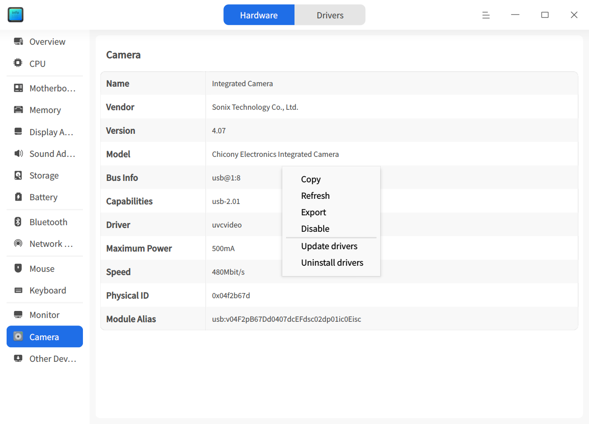

# Device Manager|deepin-devicemanager|

## Overview

Device Manager is a tool for viewing and managing hardware devices. It allows you to view hardware device information running on the operating system and perform driver management.

## Getting Started

You can run or close the Device Manager, or create shortcuts through the following methods.

### Running Device Manager

1. Click the Launcher icon  on the taskbar to enter the Launcher interface.
2. Scroll the mouse wheel or search to locate the Device Manager icon , then click to run.
3. Right-click  to:
   - Click **Send to Desktop** to create a desktop shortcut.
   - Click **Pin to Taskbar** to pin the application to the taskbar.
   - Click **Start on Boot** to add the application to startup items, automatically running when the computer starts.

### Closing Device Manager

- Click  in the Device Manager interface to exit.
- Right-click  on the taskbar and select **Close All** to exit Device Manager.
- Click  in the Device Manager interface and select **Exit** to exit Device Manager.

## Hardware Information
Device Manager displays device information related to computer hardware. If your computer is connected to devices such as a mouse or keyboard, corresponding device information will be displayed. If multiple devices of the same type are detected, device information is displayed in list form.

### Device Information

In the Device Manager interface, click **Hardware Information** to view detailed hardware information running on the operating system.

The following table introduces common hardware information for reference only; actual information may vary.

<table class="block1">
    <caption></caption>
    <tbody>
        <tr>
            <td width="150px"><b>Hardware Name</b></td>
            <td><b>Hardware Information</b></td>
        </tr>
        <tr>
            <td>Overview</td>
            <td>Displays operating system kernel information and hardware device list.</td>
        </tr>
        <tr>
            <td>Processor</td>
            <td>Displays processor name, manufacturer, processor details, and architecture.</td>
        </tr>
        <tr>
            <td>Motherboard</td>
            <td>Displays motherboard manufacturer, version, chipset, SMBIOS version, etc.</td>
        </tr>
         <tr>
            <td>Memory</td>
            <td>Displays memory name, manufacturer, size, type, and speed.</td>
      </tr>
      <tr>
            <td>Display Adapter</td>
            <td>Displays display adapter name, manufacturer, and model.</td>
        </tr>
       <tr>
            <td>Audio Adapter</td>
            <td>Displays audio adapter name, manufacturer, and model.</td>
        </tr>
         <tr>
            <td>Storage Device</td>
            <td>Displays storage device model, manufacturer, and media type.</td>
        </tr>
        <tr>
            <td>Network Adapter</td>
            <td>Displays network adapter name, manufacturer, type, and driver.</td>
        </tr>
         <tr>
            <td>Mouse</td>
            <td>Displays mouse name, manufacturer, model, and interface.</td>
        </tr>
          <tr>
            <td>Keyboard</td>
            <td>Displays keyboard name, model, manufacturer, and interface.</td>
        </tr>
        <tr>
            <td>Display Device</td>
            <td>Displays display device name, manufacturer, type, and interface.</td>
        </tr>
   </tbody>
   </table>

### Right-click Menu

Right-click in the device details area to perform related operations.

#### Copy

Copy all information on the current page. For selectable information, partial copying is also supported.

#### Refresh

Reload all current device information of the operating system. Shortcut key: **F5**.

#### Export

Export device information to a specified folder. Supports txt/docx/xls/html formats.

#### Disable/Enable

Some hardware drivers support disable and enable functions. Hardware drivers are enabled by default; check right-click menu options to determine if disabling is supported.

#### Update Driver

Some hardware supports updating/uninstalling drivers; check right-click menu options to determine.

> Tips: Driver updates are supported online in the driver management interface.

1. Select **Update Driver** from the right-click menu to open a window.
2. Select the folder containing the driver and click **Next**. "Include subfolders" is checked by default to detect driver files in subfolders.

   
3. The system will detect all installable deb and ko format driver files in the location. Select the corresponding driver file and click **Update**.

   
4. An authentication window will appear; enter the system login password to complete authentication and proceed with the update.
5. If the update fails, the system automatically rolls back the device driver to the previous version without affecting usage. It is recommended to check the failure reason according to system prompts and retry.

#### Uninstall Driver

For devices you don't want to use, you can uninstall the driver.

1. Select **Uninstall Driver** from the right-click menu, confirm again, then click **Uninstall**.
   - Uninstall successful: Device status becomes unavailable.
   - Uninstall failed: Original driver remains functional. Check failure reason according to system prompts and retry.
2. To reuse the device, right-click on the device details page and select **Update Driver** to install the driver.

#### Wake Computer

When the computer is in standby, it can be awakened using a mouse, keyboard, or network card to light up the screen. If the device is disabled, this function cannot be used.

**Wake Computer via Mouse or Keyboard**

1. In the hardware information interface, click **Mouse** or **Keyboard** to display device details.
2. Right-click in the details area and check/uncheck **Allow Wake Computer**.
   - Allowed: When computer is in standby, left/right/middle-clicking mouse or pressing any key on the keyboard will wake the computer.
   - Not allowed: Mouse/keyboard actions won't wake the computer.

**Wake Computer via Network Card**

1. In the hardware information interface, click **Network Adapter** to display device details.
2. Right-click in the details area and check/uncheck **Allow Wake Computer**.
   - Allowed: When computer is in standby, it can be awakened by receiving special network packets (Wake On LAN commands) from other computers in the same network segment.
   - Not allowed: Network packets won't wake the computer.

## Driver Management

Driver management mainly includes driver update detection, driver list display, and online driver installation.

### Driver Update Detection

Open Device Manager, click **Driver Management**, and the system will automatically detect if there are drivers that can be updated/installed.

>Note: When starting the computer, if updatable/installable drivers are detected, a prompt will appear. Click **View** to enter the driver management interface.

- No updates: No updatable/installable drivers; shows device names and versions that don't need updates.
- Updates available: Updatable/installable drivers detected; online installation is possible.

If detection fails, fix the issue according to the prompt and click **Redetect** to try again. For unknown reasons, click **Feedback** to jump to the "Service and Support" application's message consultation interface to report related issues.

### Online Driver Installation

1. In the driver management interface, view the list of updatable/installable drivers and install them online.
2. For batch installation, select corresponding drivers and click **Install All** to install them sequentially.
3. Wait for installation results.
   - Installation successful: Status changes to "Installation successful"; takes effect after rebooting.
   - Installation failed: Status changes to "Installation failed"; click the operation bar button to retry. Or click "Installation failed" to view the reason. For unknown reasons, click **Feedback** to report issues.
   - Partial success: For batch installations, some may succeed while others fail; check individual driver statuses in the list.

## Main Menu

In the main menu, you can switch window themes, view help manuals, etc.

### Theme
Window themes include Light, Dark, and System.
1. In the Device Manager interface, click .
2. Click **Theme** and select a theme color.

### Help
1. In the Device Manager interface, click .
2. Click **Help** to view the help manual and learn more about using Device Manager.

### About
1. In the Device Manager interface, click .
2. Click **About** to view the version and introduction of Device Manager.

### Exit
1. In the Device Manager interface, click .
2. Click **Exit**.