# Device Manager|deepin-devicemanager|

## Overview 

Device Manager is a tool to view and manage hardware devices, through which you can view all kinds of parameters and export data of all hardware devices running in the operating system, you can also disable/enable some hardware drives. 

## Guide

You can run, close or create a shortcut for Device Manager as follows.

### Run Device Manager

1. Click  on the Dock to enter the interface of launcher.

2. Locate  by scrolling the mouse wheel or searching "Device Manager" in the Launcher interface and click it to run. 

3. Right-click  to:

   - Select **Send to desktop** to create a shortcut on the desktop.

   - Select  **Send to dock** to fix it onto the dock.

   - Select **Add to startup** to run it automatically when the computer is turned on.

   

### Exit Device Manager

- On the main interface, click  to exit.
- Right-click   on the Dock, select **Close all** to exit.
- On interface of Device Manager, click   and select **Exit** to exit.

## Device Information

The information displayed by Device Manager is related to the computer hardwares. If your computer is connected to a mouse, keyboard, etc., the corresponding device information is displayed. If multiple devices of the same type are detected, the device information is displayed in a list. The following content is for reference only, please refer to the actual situation.

### Overview

1. On the main interface, click **Overview**.
2. You can see a list containing **CPU**, **Motherboard**, **Memory** and so on in this interface, and summary info. 

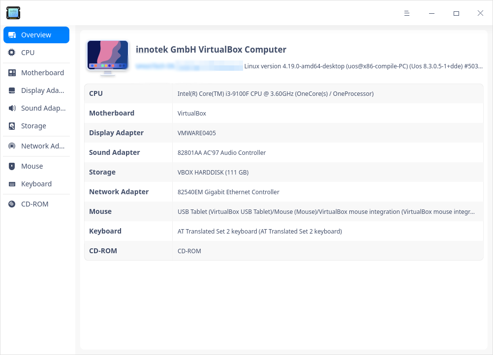

### CPU

1. On the main interface, click **CPU**.
2. You can view a CPU list and particular info such as name, vendor, CPU ID and so on. 

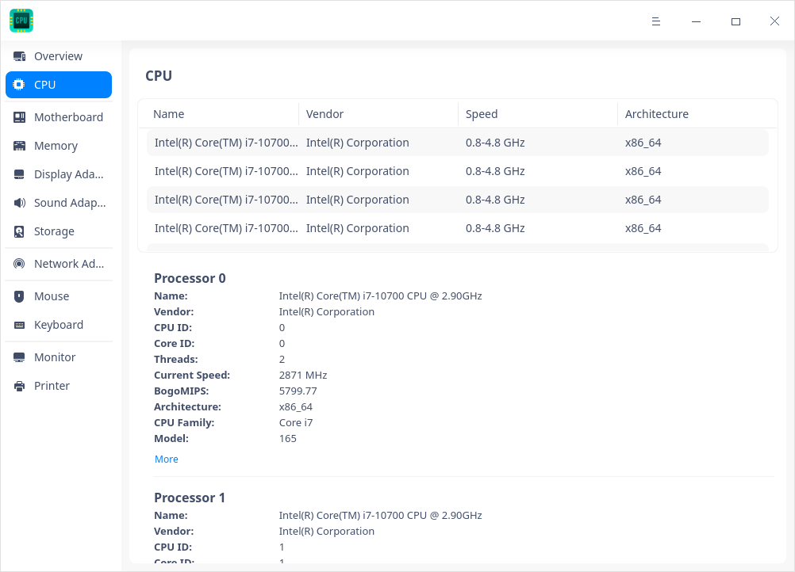

### Motherboard 

1. On the main interface, click **Motherboard**. 
2. You can view info about motherboard, such as vendor, version, chipset, and so on.

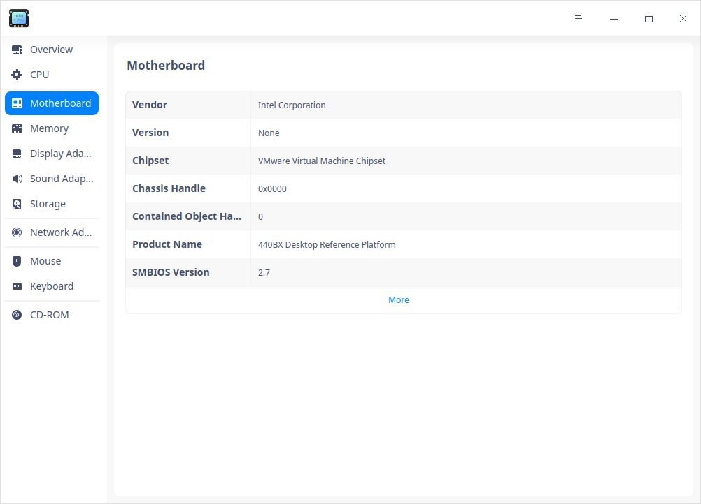

### Memory

1. On the main interface, click **Memory**.
2. You can view a memory list and particular info such as name, size, type, and so on.

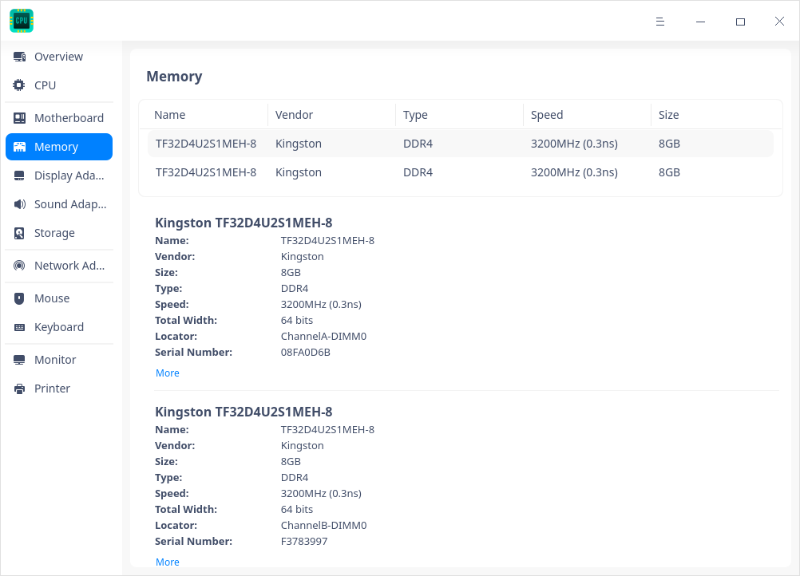

### Display Adapter

1. On the main interface, click **Display Adapter**.
2. You can view info about Display Adapter such as name, vendor, model and so on.

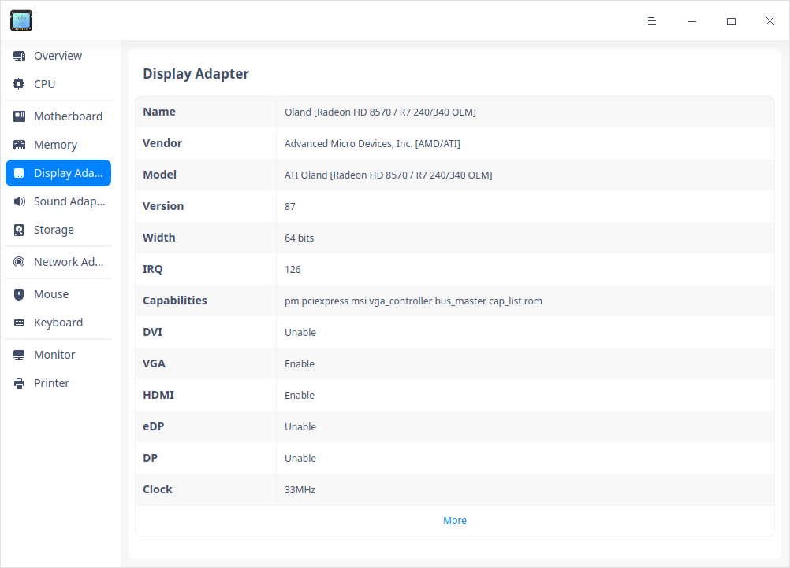

### Sound Adapter

1. On the main interface, click **Sound Adapter **.
2. You can view a list of audio adapters and info such as name, vendor, model and so on.

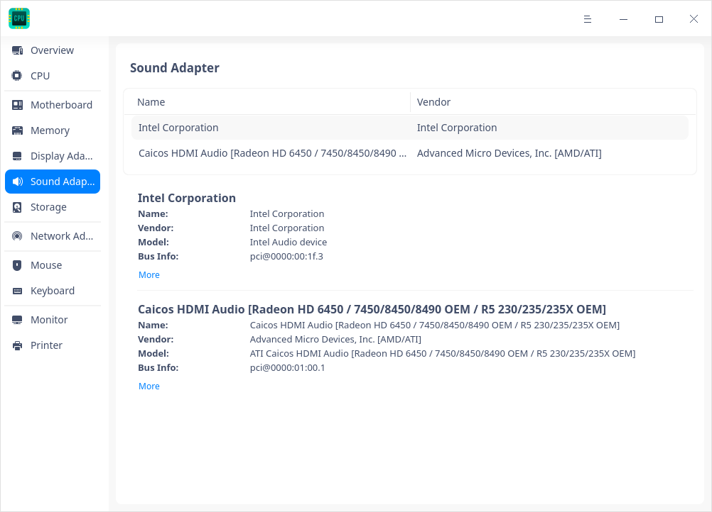

### Storage

1. On the main interface, click **Storage**.
2. You can view a storage device list and particular info such as model, vendor, media type, and so on.

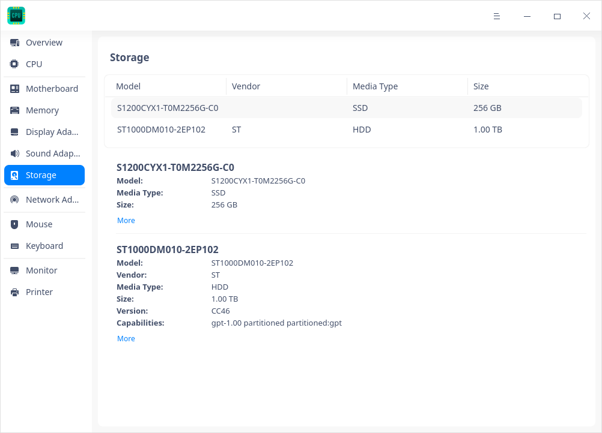

### Network Adapter

1. On the main interface, click **Network Adapter**.
2. You can view info about Network Adapter such as name, vendor, type, and so on.

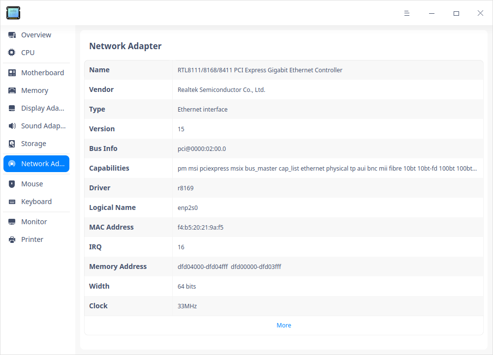

### Mouse

1. On the main interface, click **Mouse**.
2. You can view info such as name, vendor, model, and so on.

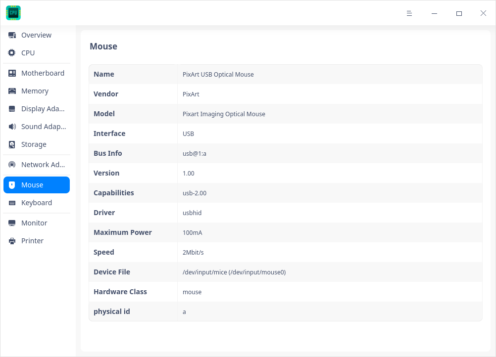

### Keyboard

1. On the main interface, click **Keyboard **.
2. You can view info such as name, vendor, model, and so on.

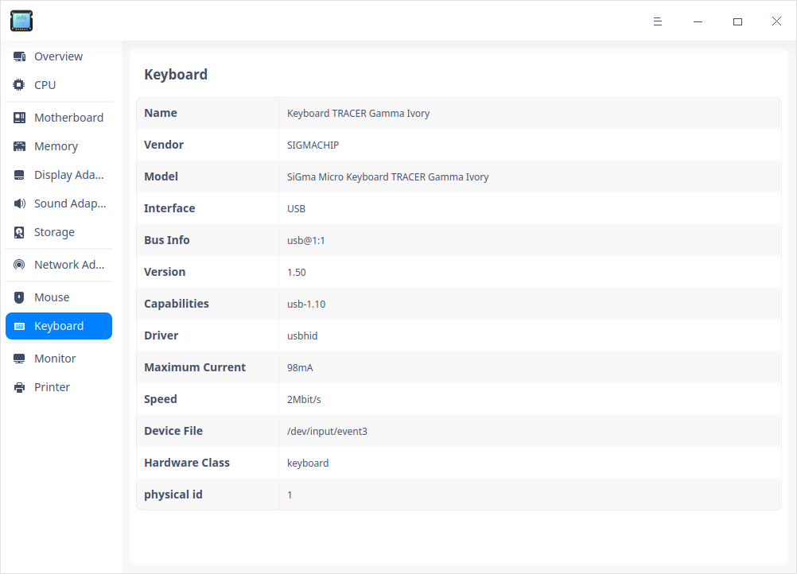

### Monitor

1. On the main interface, click **Monitor **.
2. You can view info about Monitor such as name, vendor, type and so on.

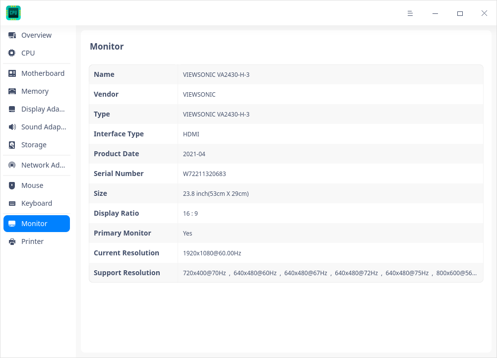

### Printer

1. On the main interface, click **Printer**.
2. You can view a list of printers connected and info such as name, model, vendor, and so on.

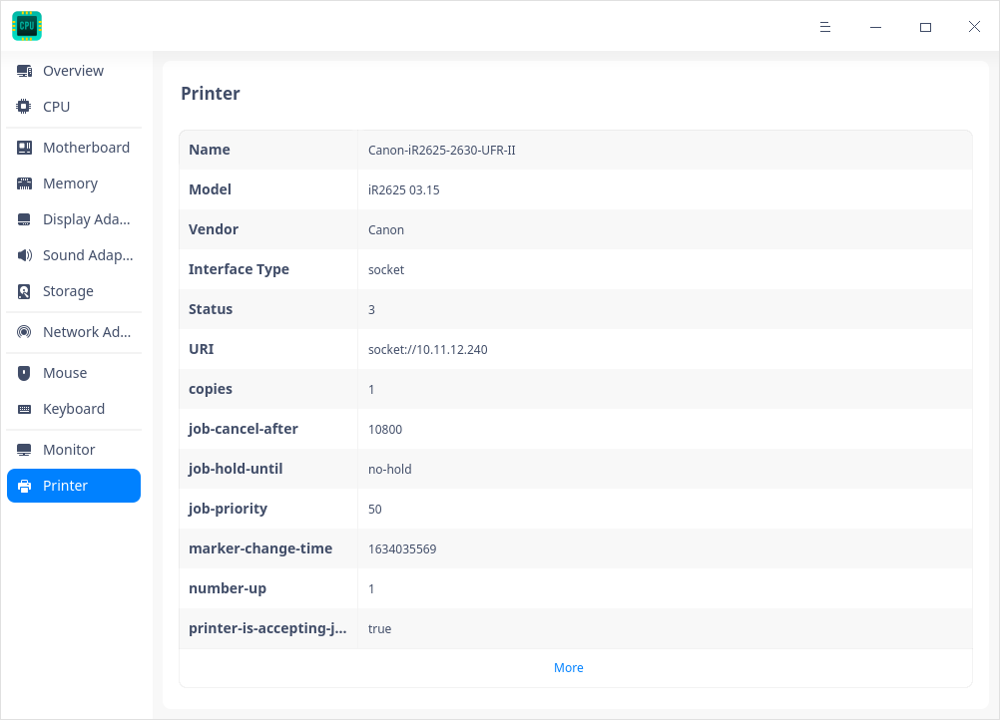

## Operations 

Right-click in the details area of any device to carry out corresponding operations.

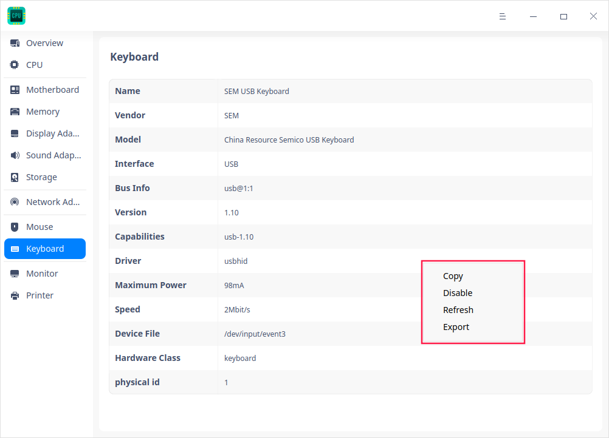

### Copy
To copy contents of the current page or selected contents.

### Refresh
To reload info of all devices of the operating system. You can also use shortcut key F5 to realize this function.

### Export
To export the device information to the specified folder, formats such as txt/docx/xls/html are supported. 

### Disable/Enable

You can disable /enable some hardware drives, which are enabled by default. You can judge whether the hardware device supports the disable function according to the right-click menu options. 

### Update drivers

Some hardware supports update/uninstall driver function, which can be judged by the right-click menu options. Currently, only local driver files are supported for installation and update.

1. Select **Update drivers** in the right-click menu to bring up a pop-up window.
2. Select the folder where the driver is located and click the **Next** button. The "Include subfolders" is checked by default, indicating that the folder and the driver files contained in the subfolder are detected.

   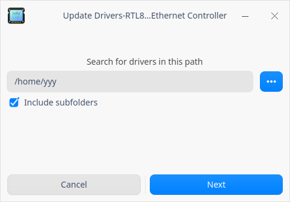

3. The system will detect all installable deb and ko format driver files contained in this file location. Select the corresponding driver file and then click the **Update** button.

   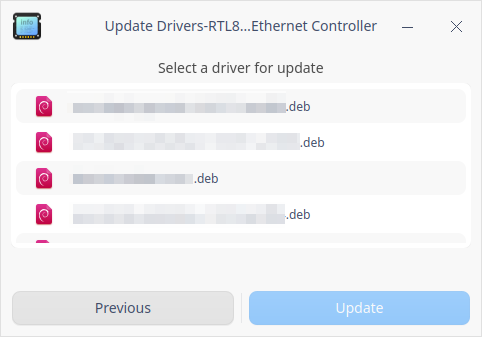

4. Authentication window pops up. Input login password to complete authentication and proceed.
5. If the update fails, the system automatically rolls back the device's driver to the previous driver version, which does not affect the use. It is recommended to find the reason of failure according to the system prompt and update again.

### Uninstall drivers

You can uninstall devices that you don't want to use.

1. Select **Uninstall drivers** in the right-click menu, after confirming again, click **Uninstall**. 

   - Successful: The device status becomes unavailable.

   - Failure: The original driver works normally. It is recommended to find the reason for failure according to the system prompt and uninstall again.

2. If you want to use the device again, right-click on the device details page and select **Update Driver** to install the driver.

### Wake up the computer

When the computer is suspending, it supports waking up the computer and lighting up the screen via mouse and keyboard. If the devices are disabled, this feature is not available.

1. Click "Mouse" or "Keyboard" in Device Manager to display details.
2. Right-click in the details area to check or uncheck **Allow it to wake the computer**.

   - Allow it to wake the computer: When the computer is in suspending, left-click / right-click / middle-click or hit any key on keyboard to wake up the computer and light up the screen.
   - Don't allow it to wake the computer: When the computer is in suspending, the computer does not respond when you  left-click / right-click / middle-click or hit any key on keyboard.

## Main Menu

In the main menu, you can switch themes, view manual, and so on.

### Theme

The window theme includes Light Theme, Dark Theme and System Theme.

1. Click on the interface.
2. Click  **Theme** to select one.

### Help

Click Help to get the manual, which will help you further know and use Device Manager.

1. Click on the interface.
2. Click **Help** to view the manual.

### About

1. Click on the interface.
2. Click **About** to view version and introduction about Device Manager.

### Exit

1. Click on the interface.
2. Click  **Exit**.

