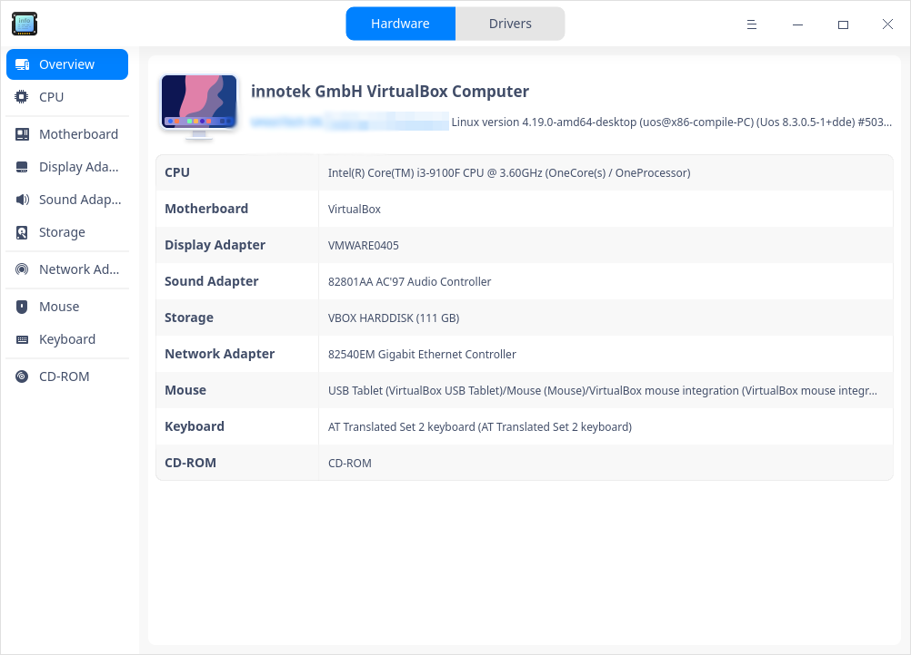

# Device Manager|deepin-devicemanager|

## Overview 

Device Manager is a tool to view and manage hardware devices, through which you can view all kinds of parameters and export data of all hardware devices running in the operating system, you can also disable/enable some hardware drives. 

## Guide

You can run, close or create a shortcut for Device Manager as follows.

### Run Device Manager

1. Click  on the Dock to enter the interface of launcher.

2. Locate  by scrolling the mouse wheel or searching "Device Manager" in the Launcher interface and click it to run. 

3. Right-click  to:

   - Select **Send to desktop** to create a shortcut on the desktop.

   - Select  **Send to dock** to fix it onto the dock.

   - Select **Add to startup** to run it automatically when the computer is turned on.

   

### Exit Device Manager

- On the main interface, click  to exit.
- Right-click   on the Dock, select **Close all** to exit.
- On interface of Device Manager, click   and select **Exit** to exit.

## Device Information

The information displayed by Device Manager is related to the computer hardware. If your computer is connected to devices such as mouse and keyboard, the corresponding device information will be displayed. If multiple devices of the same type are detected, the device information is displayed in a list. The following contents are for reference only, please refer to the actual situation.

### Overview

1. On the main interface, click **Overview**.
2. View the information of kernel and all hardware. 

### CPU

1. On the main interface, click **CPU**.
2. You can view a CPU list and particular info such as name, vendor, CPU ID and so on. 

### Motherboard 

1. On the main interface, click **Motherboard**. 
2. You can view info about motherboard, such as vendor, version, chipset, and so on.

### Memory

1. On the main interface, click **Memory**.
2. You can view a memory list and particular info such as name, size, type, and so on.

### Display Adapter

1. On the main interface, click **Display Adapter**.
2. You can view info about Display Adapter such as name, vendor, model and so on.

### Sound Adapter

1. On the main interface, click **Sound Adapter **.
2. You can view a list of audio adapters and info such as name, vendor, model and so on.

### Storage

1. On the main interface, click **Storage**.
2. You can view a storage device list and particular info such as model, vendor, media type, and so on.

### Network Adapter

1. On the main interface, click **Network Adapter**.
2. You can view info about Network Adapter such as name, vendor, type, and so on.

### Keyboard

1. On the main interface, click **Keyboard **.
2. You can view info such as name, vendor, model, and so on.

### Monitor

1. On the main interface, click **Monitor **.
2. You can view info about Monitor such as name, vendor, type and so on.

## Operations 

In the device details area, right-click and you will have several options.

### Copy

To copy current page, or, some selectable information.

### Refresh

To reload info of all current devices of the operating system. You can also use shortcut key F5.

### Export

To export the device information to the specified folder,formats such as txt/docx/xls/html are supported. 

### Disable/Enable

Some hardware drivers can be enabled / disabled. Drivers are enabled by default. You can judge whether the hardware device supports the disable function according to the right-click menu options. 

### Update drivers

Some hardware can be updated / uninstalled, which can be judged according to the right-click menu options. Currently, only installation and updates of local driver files are supported.  

1. Right-click and select **Update drivers**, a window pops up.

2. Select the folder where the driver is located and click **Next**. "Include subfolders" is checked by default, which means to detect the driver files contained in the folder and its subfolders.

   

3. The system will detect all installable driver files (in deb and ko format) contained in the file location. Select the corresponding driver file and click **Update**.

   

4. The authentication window pops up. Enter the system login password and update it after authentication.

5. If the update fails, the system will automatically roll back the driver of the device to the previous driver version, which will not affect the use. It is recommended to find out the reason for the failure and update it again according to the system prompt.

### Uninstall drivers

You can uninstall the driver of the devices you don't want to use.

1. Select **Uninstall drivers** in the right-click menu, and click **Uninstall**.

   - Successful: the device status changes to unavailable.
   - Failed: the original driver is in normal use. It is recommended to find out the failure reason according to the system prompt and uninstall again.

2. If you want to reuse the device, right-click on the device details page and select **Update drivers** to install the driver.

## Main Menu

In the main menu, you can switch themes, view manual, and so on.

### Theme

The window theme includes Light Theme, Dark Theme and System Theme.

1. Click on the interface.
2. Click  **Theme** to select one.

### Help

Click Help to get the manual, which will help you further know and use Device Manager.

1. Click on the interface.
2. Click **Help** to view the manual.

### About

1. Click on the interface.
2. Click **About** to view version and introduction about Device Manager.

### Exit

1. Click on the interface.
2. Click  **Exit**.

