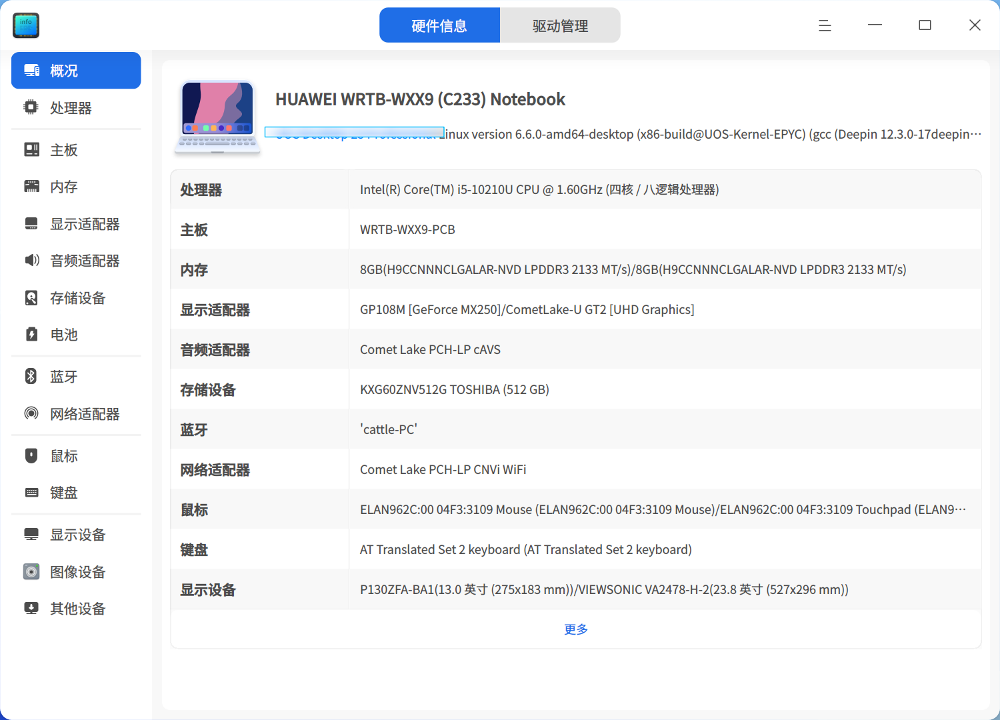
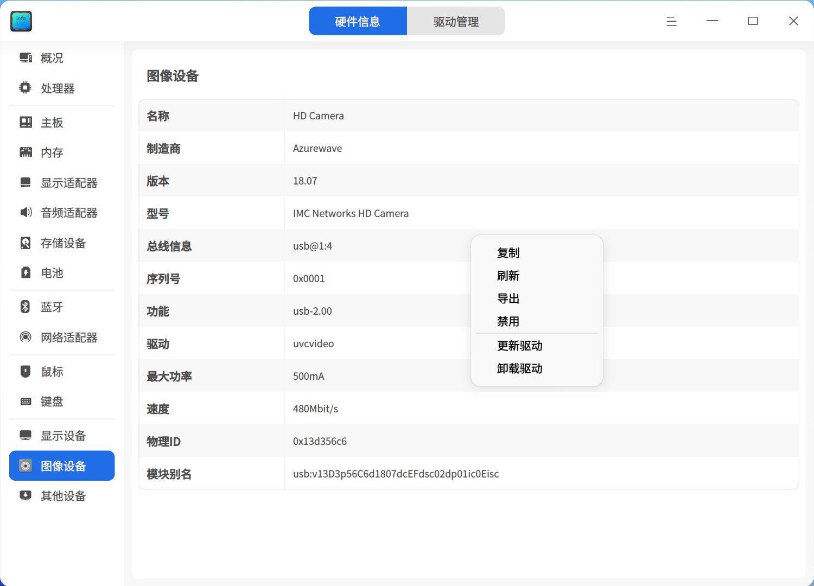
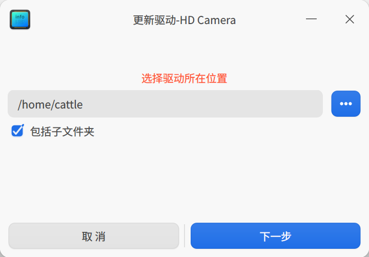
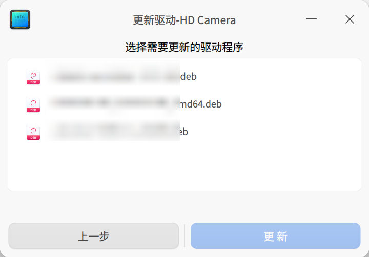
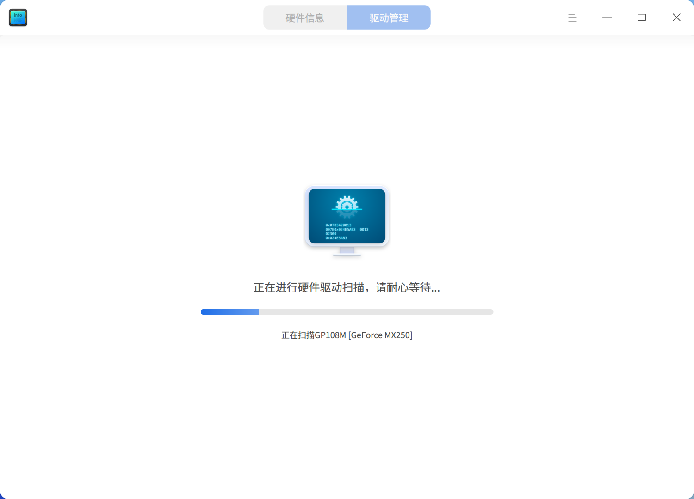

# 设备管理器|deepin-devicemanager|

## 概述

设备管理器是查看和管理硬件设备的工具，可以查看运行在操作系统的硬件设备信息，并进行驱动管理。

## 使用入门

您可以通过以下方式运行或关闭设备管理器，或者创建快捷方式。

### 运行设备管理器

1. 单击任务栏上的启动器图标 ，进入启动器界面。

2. 上下滚动鼠标滚轮浏览或通过搜索，找到设备管理器图标  ，并单击运行。

3. 右键单击  ，您可以：

   - 单击 **发送到桌面**，在桌面创建快捷方式。

   - 单击 **发送到任务栏**，将应用程序固定到任务栏。

   - 单击 **开机自动启动**，将应用程序添加到开机启动项，在电脑开机时自动运行该应用程序。

### 关闭设备管理器

- 在设备管理器界面，单击   ，退出设备管理器。
- 右键单击任务栏上的  ，选择 **关闭所有** 来退出设备管理器。
- 在设备管理器界面单击  ，选择 **退出** 来退出设备管理器。

## 硬件信息
设备管理器展示的设备信息与电脑硬件相关，如果您的电脑接入鼠标、键盘等设备，则会显示对应的设备信息。如果检测到多个同类型设备，则以列表形式显示设备信息。

### 设备信息

在设备管理器界面，单击 **硬件信息**，查看运行在操作系统上的硬件详细信息。

下表主要介绍常见的硬件信息，仅作参考，请以实际情况为准。

<table class="block1">
    <caption></caption>
    <tbody>
        <tr>
            <td width="150px"><b>硬件名称</b></td>
            <td><b>硬件信息</b></td>
        </tr>
        <tr>
            <td>概况</td>
            <td>展示操作系统内核信息及各硬件设备列表。</td>
        </tr>
        <tr>
            <td>处理器</td>
            <td>展示处理器的名称、制造商、处理器及架构等信息。</td>
        </tr>
        <tr>
            <td>主板</td>
            <td>展示主板的制造商、版本、芯片组、SMBIOS版本等信息。</td>
        </tr>
         <tr>
            <td>内存</td>
            <td>展示内存的名称、制造商、大小、类型及速度等信息。</td>
      </tr>
      <tr>
            <td>显示适配器</td>
            <td>展示显示适配器的名称、制造商、型号等信息。</td>
        </tr>
       <tr>
            <td>音频适配器</td>
            <td>展示音频适配器的名称、制造商及型号等信息。</td>
        </tr>
         <tr>
            <td>存储设备</td>
            <td>展示存储设备的型号、制造商、介质类型等信息。</td>
        </tr>
        <tr>
            <td>网络适配器</td>
            <td>展示网络适配器的名称、制造商、类型及驱动等信息。</td>
        </tr>
         <tr>
            <td>鼠标</td>
            <td>展示鼠标的名称、制造商、型号及接口等信息。</td>
        </tr>
          <tr>
            <td>键盘</td>
            <td>展示键盘的名称、型号、制造商、接口等信息。</td>
        </tr>
        <tr>
            <td>显示设备</td>
            <td>展示显示设备的名称、制造商、类型、接口类型等信息。</td>
        </tr>
   </tbody>
   </table>

### 右键菜单

在设备详细信息区域，单击右键，可以进行相关操作。

#### 复制

复制当前页面的所有信息。对于可选中的信息，也可以局部复制。

#### 刷新

将重新加载操作系统当前所有设备的信息，快捷键为 **F5**。

#### 导出

将设备信息导出到指定的文件夹，支持导出 txt/docx/xls/html 格式。

#### 禁用/启用

部分硬件驱动支持禁用和启用功能，硬件驱动默认是启用状态，根据右键菜单选项判断是否支持禁用功能。

#### 更新驱动

部分硬件支持更新/卸载驱动功能，可以根据右键菜单选项进行判断。

> 窍门：在驱动管理界面，支持在线更新驱动。

1. 在右键菜单中选择 **更新驱动**，弹出窗口。

2. 选择驱动所在的文件夹，单击 **下一步** 按钮。默认勾选 “包括子文件夹”，表示检测文件夹以及子文件夹中包含的驱动文件。

   

3. 系统会检测该文件位置包含的所有可安装的deb和ko格式驱动文件，选择对应的驱动文件后，单击 **更新** 按钮。

   

4. 弹出认证窗口，输入系统登录密码完成认证后进行更新。

5. 如果更新失败了，系统自动将该设备的驱动回滚至之前的驱动版本，不影响使用。建议根据系统提示查找失败原因，重新更新。

#### 卸载驱动

对于不想使用的设备，可以卸载驱动。

1. 在右键菜单中选择 **卸载驱动**，二次确认后，单击 **卸载** 按钮。

   - 卸载成功：设备状态变为不可用。

   - 卸载失败：原驱动正常使用，建议根据系统提示查找失败原因，重新卸载。

2. 如果想重新使用该设备，在设备详细信息页面单击右键，并选择 **更新驱动** 安装驱动。

#### 唤起电脑

当电脑待机时，支持通过鼠标、键盘和网卡唤起电脑，点亮屏幕。如果设备禁用，则无法使用该功能。

**通过鼠标和键盘唤起电脑**

1. 在硬件信息界面，单击 **鼠标** 或 **键盘**，显示设备详细信息。

2. 在详细信息区域单击右键，可以勾选或去勾选 **允许唤起电脑**。

   - 允许唤起电脑：电脑处于待机状态时，左击/右击/单击鼠标中键或敲击该键盘任意键，可将电脑唤起，点亮屏幕。

   - 不允许唤起电脑：电脑处于待机状态时，左击/右击/单击鼠标中键或敲击键盘，电脑无响应。

**通过网卡唤起电脑**

1. 在硬件信息界面，单击 **网络适配器**，显示设备详细信息。

2. 在详细信息区域单击右键，可以勾选或去勾选 **允许唤起电脑**。

   - 允许唤起电脑：本机处于待机状态时，其他电脑设备（在同一网段，即可以ping通对方ip）向本机发送特殊网络包请求（Wake On LAN 命令），可将本机唤起，点亮屏幕。

   - 不允许唤起电脑：电脑处于待机状态时，其他电脑设备（在同一网段，即可以ping通对方ip）向本机发送特殊网络包请求（Wake On  LAN 命令），本机无响应。

## 驱动管理

驱动管理主要包括驱动更新检测、驱动列表信息展示、驱动在线安装等内容。

### 驱动更新检测

打开设备管理器，单击 **驱动管理**，系统会自动检测是否有可更新/安装的驱动。

>说明：当启动电脑时，如果检测到有可更新/安装的驱动，会弹出提示信息，单击 **查看** 按钮则可以进入驱动管理界面。

- 无更新：表示没有可更新/安装的驱动，展示无需更新驱动的设备名称及版本。
- 有更新：表示检测到可更新/安装的驱动，可以进行在线安装。

如果显示检测失败，根据提示信息修复问题后单击 **重新检测** 再次检测，对于未知的原因则可以单击 **反馈** 按钮跳转到“服务与支持”应用的留言咨询界面，反馈相关问题。

### 驱动在线安装

1. 在驱动管理界面，可以查看可更新/安装的驱动列表，并进行在线安装。

2. 如果想要批量安装，则可以勾选对应的驱动，单击 **一键安装**，将依次进行安装。
3. 等待安装结果。

   - 安装成功：状态栏变为“安装成功”，重启电脑后生效。

   - 安装失败：状态栏变为“安装失败”，单击操作栏按钮再次尝试安装。或单击状态栏的“安装失败”查看失败原因，对于未知的原因，则可以单击 **反馈** 按钮跳转到“服务与支持”应用的留言咨询界面，反馈相关问题。
   - 部分安装成功：对于批量安装的驱动，可能部分安装成功，部分安装失败，可以在驱动列表中查看对应驱动的状态。

## 主菜单

在主菜单中，可以进行切换窗口主题，查看帮助手册等操作。

### 主题

窗口主题包含浅色主题、深色主题和系统主题。

1. 在设备管理器界面，单击 。
2. 单击 **主题**，选择一个主题颜色。

### 帮助

1. 在设备管理器界面，单击 。
2. 单击 **帮助**，查看帮助手册，进一步了解和使用设备管理器。

### 关于

1. 在设备管理器界面，单击 。
2. 单击 **关于**，查看设备管理器的版本和介绍。

### 退出

1. 在设备管理器界面，单击 。
2. 单击 **退出**。

