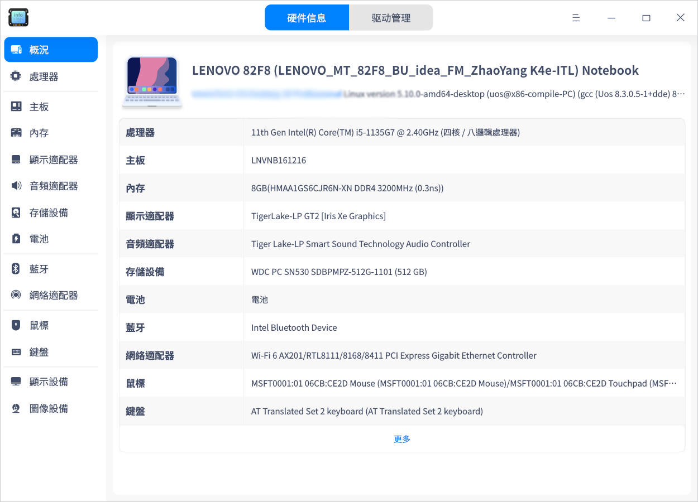
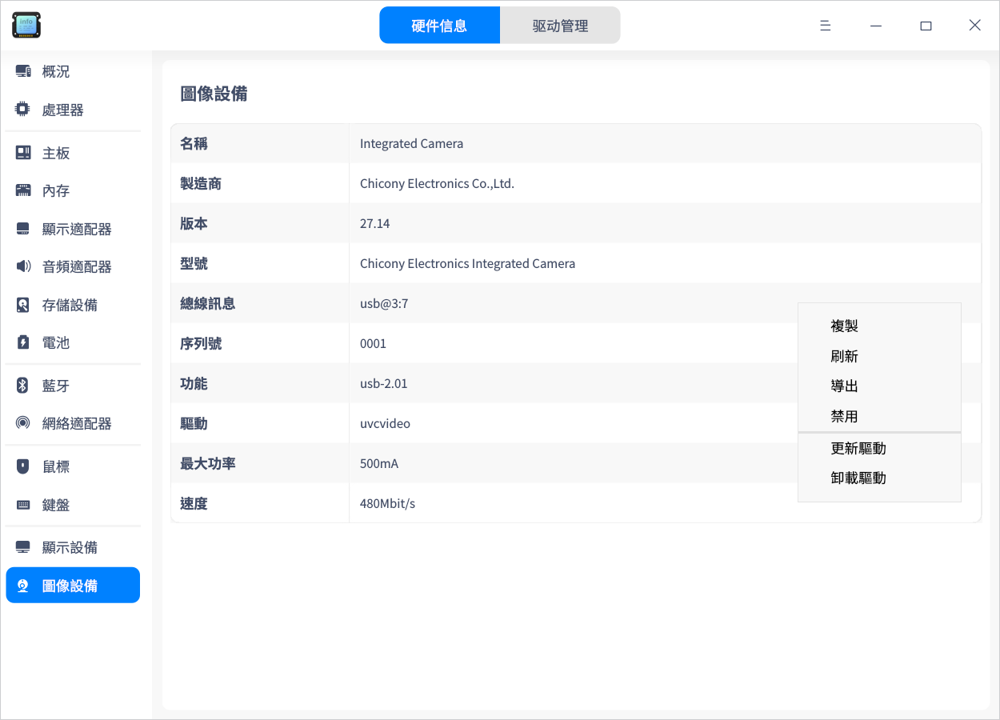

# 設備管理器|deepin-devicemanager|

## 概述

設備管理器是查看和管理硬件設備的工具軟件，可針對運行在操作系統的硬件設備，進行參數狀態的查看、數據訊息的導出等，還可以禁用或啟動部分硬件驅動。

## 使用入門

您可以通過以下方式運行或關閉設備管理器，或者創建快捷方式。

### 運行設備管理器

1. 單擊任務欄上的啟動器圖標 ，進入啟動器界面。

2. 上下滾動鼠標滾輪瀏覽或通過搜索，找到設備管理器圖標 ，單擊運行。

3. 右鍵單擊 ，您可以：
- 單擊 **傳送到桌面**，在桌面創建快捷方式。
  
- 單擊 **傳送到任務欄**，將應用程序固定到快速工具列。
  
- 單擊 **加至開機啟動**，將應用程序添加到開機啟動項，在電腦開機時自動運行該應用程序。

### 關閉設備管理器

- 在設備管理器界面，單擊 ，退出設備管理器。
- 右鍵單擊任務欄上的 ，選擇 **關閉所有** 來退出設備管理器。
- 在設備管理器界面單擊 ，選擇 **退出** 來退出設備管理器。

## 設備訊息

設備管理器展示的訊息與電腦硬件相關，如果您的電腦接入鼠標、鍵盤等設備，則會顯示對應的設備訊息。如果檢測到多個同類型設備，則以列表形式顯示設備訊息。以下內容僅作參考，請以實際情況為準。

### 概況

1. 在設備管理器界面，單擊 **概況**。
2. 查看操作系統內核訊息及各硬件設備列表。

### 處理器

1. 在設備管理器界面，單擊 **處理器**。
2. 查看處理器的名稱、製造商、處理器及架構等訊息。

### 主板

1. 在設備管理器界面，單擊 **主板**。
2. 查看主板的製造商、版本、晶片組、SMBIOS版本等訊息。

### 內存

1. 在設備管理器界面，單擊 **內存**。
2. 查看內存的名稱、製造商、大小、類型及速度等訊息。

### 顯示適配器

1. 在設備管理器界面，單擊 **顯示適配器**。
2. 查看顯示適配器的名稱、製造商、型號等訊息。

### 音頻適配器

1. 在設備管理器界面，單擊 **音頻適配器**。
2. 查看音頻適配器的名稱、製造商及型號等訊息。

### 存儲設備

1. 在設備管理器界面，單擊 **存儲設備**。
2. 查看存儲設備的型號、製造商、介質類型等訊息。

### 網絡適配器

1. 在設備管理器界面，單擊 **網絡適配器**。
2. 查看網絡適配器的名稱、製造商、類型及驅動等訊息。

### 鍵盤

1. 在設備管理器界面，單擊 **鍵盤**。
2. 查看鍵盤的名稱、型號、製造商、接口等訊息。

### 顯示設備

1. 在設備管理器界面，單擊 **顯示設備**。
2. 查看顯示設備的名稱、製造商、類型、接口類型等訊息。

## 操作介紹

在設備詳細訊息區域，單擊右鍵，可以進行相關操作。

### 複製

複製當前頁面的所有訊息。對於可選中的訊息，也可以局部複製。

### 刷新

將重新加載操作系統當前所有設備的訊息，快捷鍵為 **F5**。

### 導出

將設備訊息導出到指定的文件夾，支持導出 txt/docx/xls/html 格式。

### 禁用/啟用

部分硬件驅動支持禁用和啟用功能，硬件驅動默認是啟用狀態，根據右鍵菜單選項判斷是否支持禁用功能。

### 更新驅動

部分硬件支持更新/卸載驅動功能，可以根據右鍵菜單選項進行判斷。當前僅支持本地驅動文件的安裝更新。

1. 在右鍵菜單中選擇 **更新驅動**，彈出窗口。

2. 選擇驅動所在的文件夾，單擊 **下一步** 按鈕。默認勾選「包括子文件夾」，表示檢測文件夾以及子文件夾中包含的驅動文件。

   

3. 系統會檢測該文件位置包含的所有可安裝的deb和ko格式驅動文件，選擇對應的驅動文件後，單擊 **更新** 按鈕。

   

4. 彈出認證窗口，輸入系統登錄密碼完成認證後進行更新。

5. 如果更新失敗了，系統自動將該設備的驅動回滾至之前的驅動版本，不影響使用。建議根據系統提示查找失敗原因，重新更新。

### 卸載驅動

對於不想使用的設備，可以卸載驅動。

1. 在右鍵菜單中選擇 **卸載驅動**，二次確認後，單擊 **卸載** 按鈕。

   - 卸載成功：設備狀態變為不可用。

   - 卸載失敗：原驅動正常使用，建議根據系統提示查找失敗原因，重新卸載。

2. 如果想重新使用該設備，在設備詳細訊息頁面單擊右鍵，並選擇 **更新驅動** 安裝驅動。

### 喚起電腦

當電腦待機時，支持通過鼠標和鍵盤喚起電腦，點亮螢幕。如果設備禁用，則無法使用該功能。

1. 在設備管理器中，單擊鼠標或鍵盤，顯示設備詳細訊息。

2. 在詳細訊息區域單擊右鍵，可以勾選或去勾選 **允許喚起電腦**。

   - 允許喚起電腦：電腦處於待機狀態時，左擊/右擊/中鍵/晃動/滾動鼠標或敲擊該鍵盤任意鍵，可將電腦喚起，點亮螢幕。

   - 不允許喚起電腦：電腦處於待機狀態時，左擊/右擊/中鍵/晃動/滾動鼠標或敲擊鍵盤，電腦無響應。

## 主菜單

在主菜單中，您可以進行切換窗口主題，查看幫助手冊等操作。

### 主題

窗口主題包含淺色主題、深色主題和跟隨系統主題。

1. 在設備管理器界面，單擊 。
2. 單擊 **主題**，選擇一個主題顏色。

### 幫助

1. 在設備管理器界面，單擊 。
2. 單擊 **幫助**，查看幫助手冊，進一步了解和使用設備管理器。

### 關於

1. 在設備管理器界面，單擊 。
2. 單擊 **關於**，查看設備管理器的版本和介紹。

### 退出

1. 在設備管理器界面，單擊 。
2. 單擊 **退出**。