# 設備管理器|deepin-devicemanager|

## 概述

設備管理器是查看和管理硬件設備的工具軟件，可針對運行在操作系統的硬件設備，進行參數狀態的查看、數據訊息的導出等，還可以禁用或啟動部分硬件驅動。

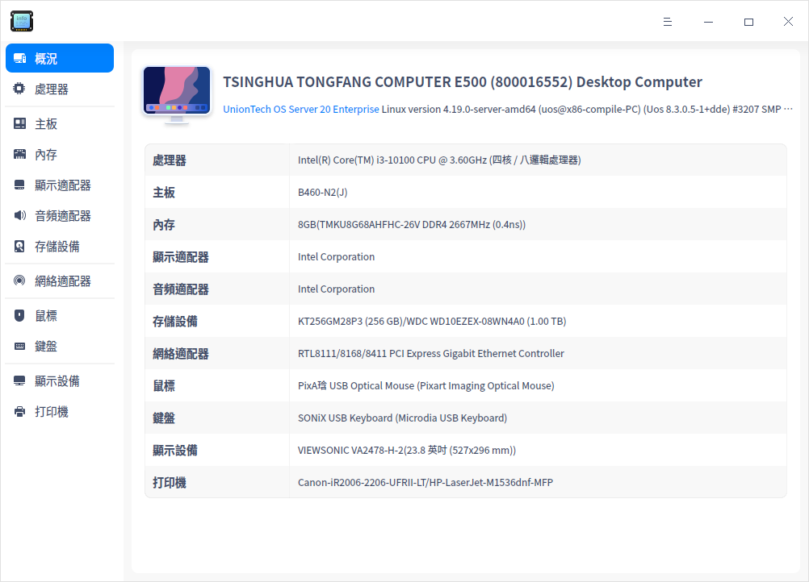

## 使用入門

您可以通過以下方式運行或關閉設備管理器，或者創建快捷方式。

### 運行設備管理器

1. 單擊任務欄上的啟動器圖標 ，進入啟動器界面。

2. 上下滾動鼠標滾輪瀏覽或通過搜索，找到設備管理器圖標 ，單擊運行。

3. 右鍵單擊 ，您可以：
- 單擊 **傳送到桌面**，在桌面創建快捷方式。
  
- 單擊 **傳送到任務欄**，將應用程序固定到快速工具列。
  
- 單擊 **加至開機啟動**，將應用程序添加到開機啟動項，在電腦開機時自動運行該應用程序。

### 關閉設備管理器

- 在設備管理器界面，單擊 ，退出設備管理器。
- 右鍵單擊任務欄上的 ，選擇 **關閉所有** 來退出設備管理器。
- 在設備管理器界面單擊 ，選擇 **退出** 來退出設備管理器。

## 操作介紹

以下介紹的硬件設備信息僅供參考，如果您的電腦上沒有插入鼠標、鍵盤等設備，設備管理器中則不會顯示對應的硬件信息。

### 概況

1. 在設備管理器界面，單擊 **概況**。
2. 查看操作系統內核訊息及各硬件設備列表。

### 處理器

1. 在設備管理器界面，單擊 **處理器**。
2. 查看處理器列表，以及所有處理器的詳細訊息如名稱、製造商、架構及型號等訊息。

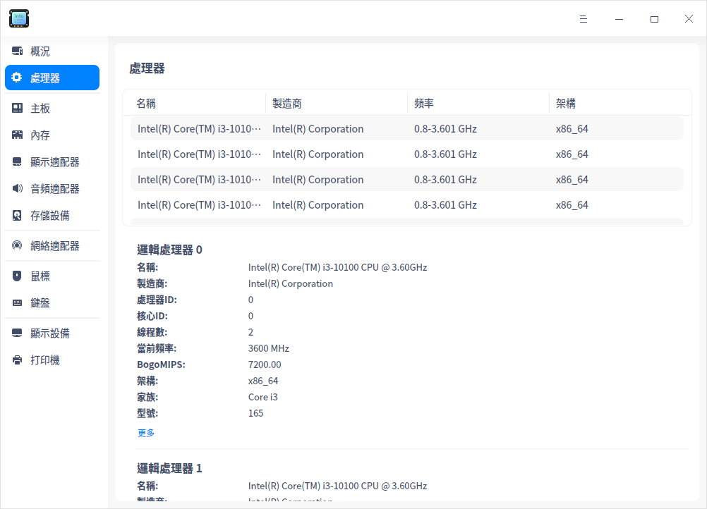

### 主板

1. 在設備管理器界面，單擊 **主板**。
2. 查看主板的製造商、晶片組、BIOS訊息、系統訊息及機箱訊息等。

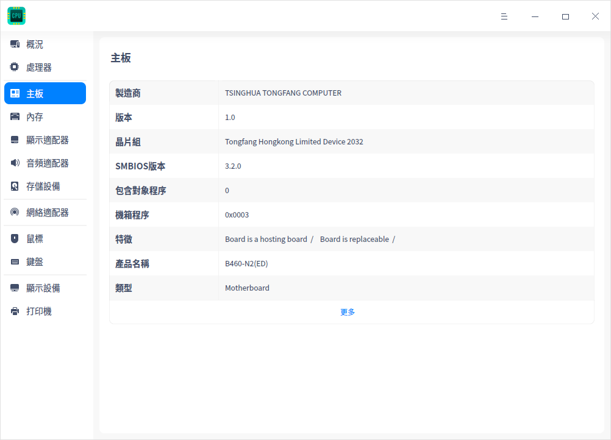

### 內存

1. 在設備管理器界面，單擊 **內存**。
2. 查看內存列表，以及所有內存的詳細訊息，如名稱、大小及類型等訊息。

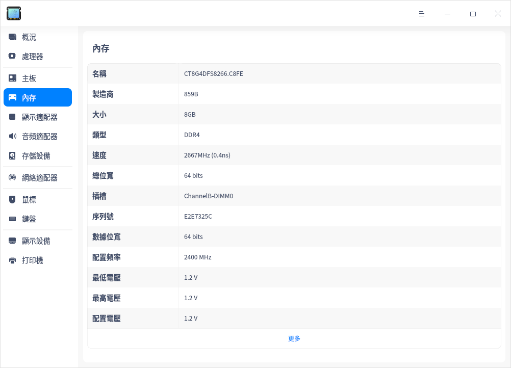

### 顯示適配器

1. 在設備管理器界面，單擊 **顯示適配器**。
2. 查看顯示適配器的名稱、製造商、型號及驅動等訊息。

### 音頻適配器

1. 在設備管理器界面，單擊 **音頻適配器**。
2. 查看音頻適配器列表，以及所有音頻適配器的詳細訊息，如名稱、製造商、型號及驅動等訊息。

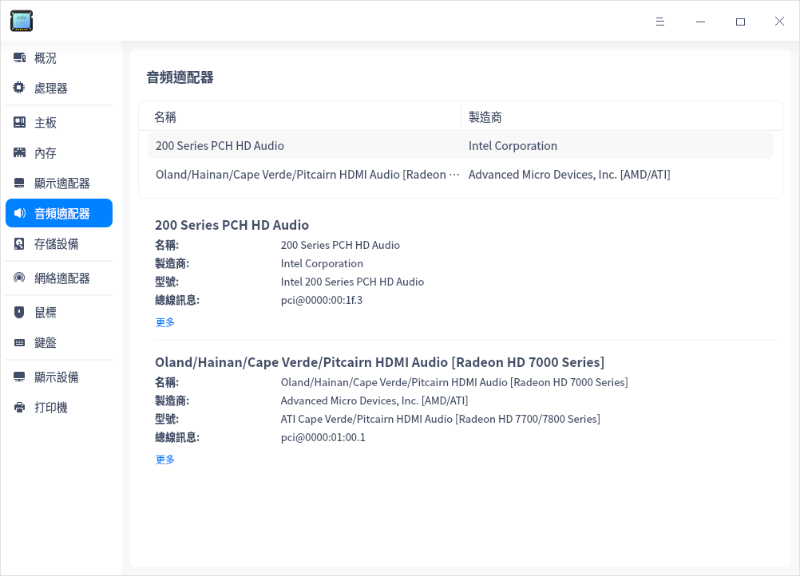

### 存儲設備

1. 在設備管理器界面，單擊 **存儲設備**。
2. 查看存儲設備列表，以及所有存儲設備的詳細訊息，如型號、製造商、介質類型、大小及轉速等訊息。

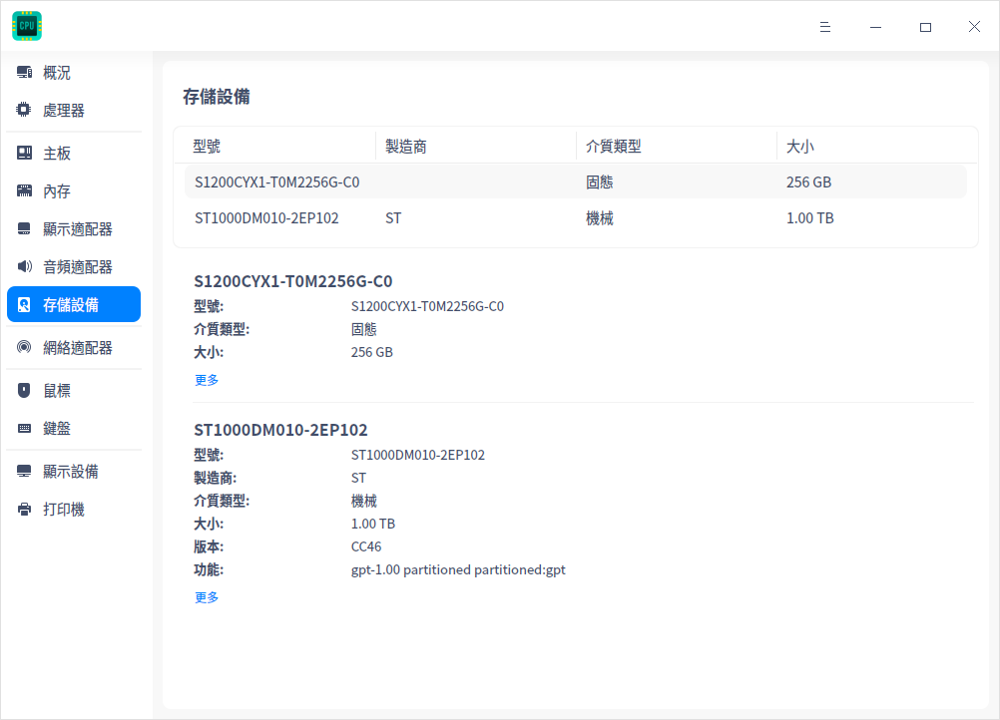

### 網絡適配器

1. 在設備管理器界面，單擊 **網絡適配器**。
2. 查看網絡適配器的名稱、製造商、類型及驅動等訊息。

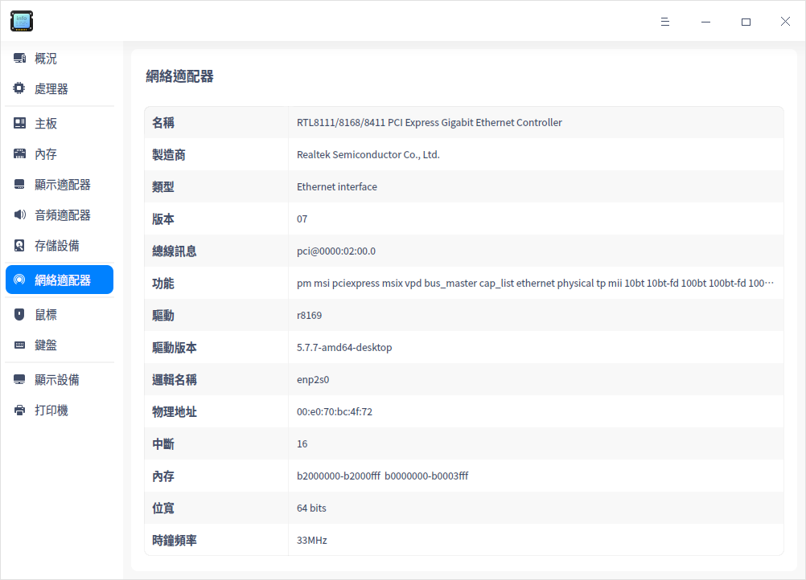

### 鼠標

1. 在設備管理器界面，單擊 **鼠標**。
2. 查看鼠標的名稱、製造商、總線訊息、驅動及頻率等訊息。

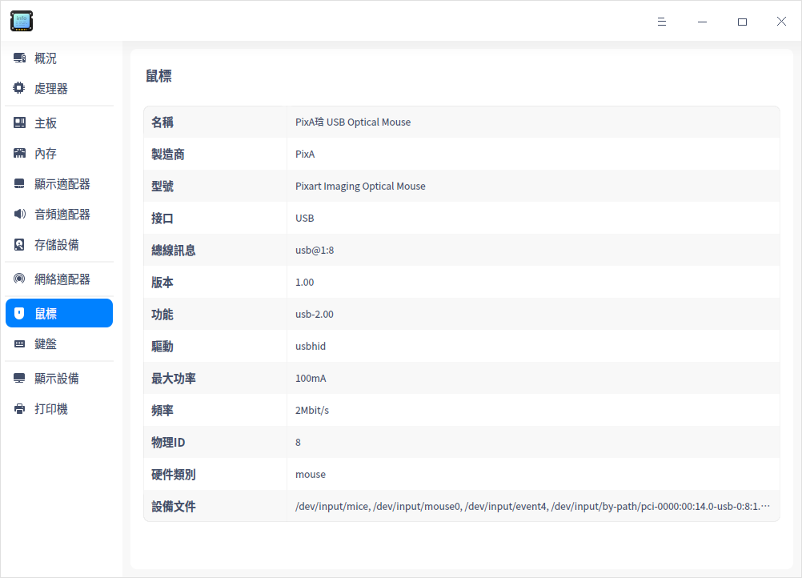

### 鍵盤

1. 在設備管理器界面，單擊 **鍵盤**。
2. 查看鍵盤的名稱、製造商、型號及接口等訊息。

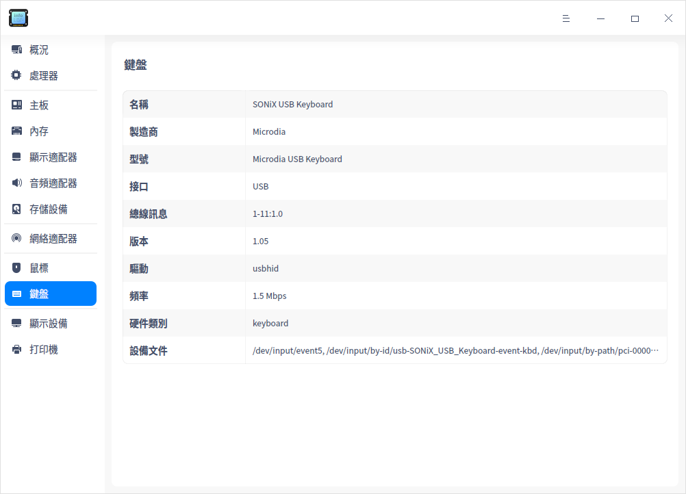

### 顯示設備

1. 在設備管理器界面，單擊 **顯示設備**。
2. 查看顯示設備的名稱、製造商、類型、接口類型及解像度等訊息。

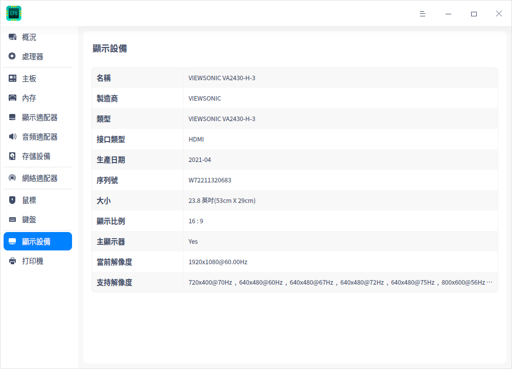

### 打印機

1. 在設備管理器界面，單擊 **打印機**。
2. 查看打印機列表，以及所有打印機的詳細訊息，如名稱、型號、製造商、URI等訊息。

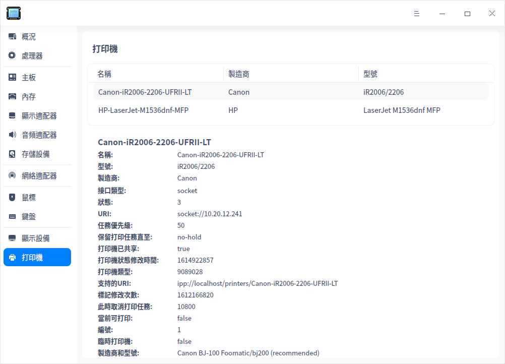

### 右鍵菜單

- **複製**：複製當前頁面的所有訊息。
- **禁用/啟用**：可禁用或啟用部分硬件驅動，可根據右鍵菜單選項判斷硬件設備是否支持禁用功能。
- **刷新**：將重新加載操作系統當前所有設備的訊息，快捷鍵為 **F5**。
- **導出**：將設備信息導出到指定的文件夾，支持導出 txt/docx/xls/html 格式。

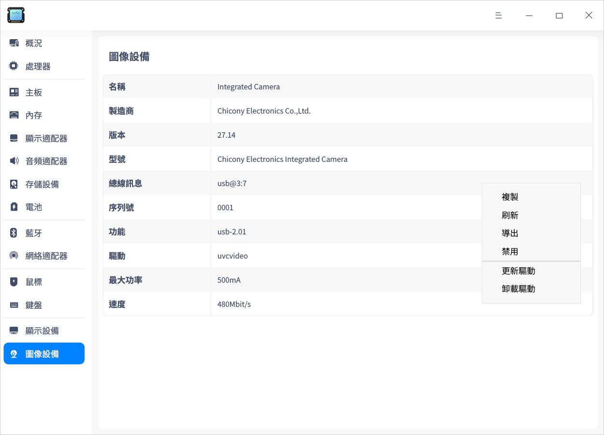

## 主菜單

在主菜單中，您可以進行切換窗口主題，查看幫助手冊等操作。

### 主題

窗口主題包含淺色主題、深色主題和跟隨系統主題。

1. 在設備管理器界面，單擊 。
2. 單擊 **主題**，選擇一個主題顏色。

### 幫助

1. 在設備管理器界面，單擊 。
2. 單擊 **幫助**，查看幫助手冊，進一步了解和使用設備管理器。

### 關於

1. 在設備管理器界面，單擊 。
2. 單擊 **關於**，查看設備管理器的版本和介紹。

### 退出

1. 在設備管理器界面，單擊 。
2. 單擊 **退出**。