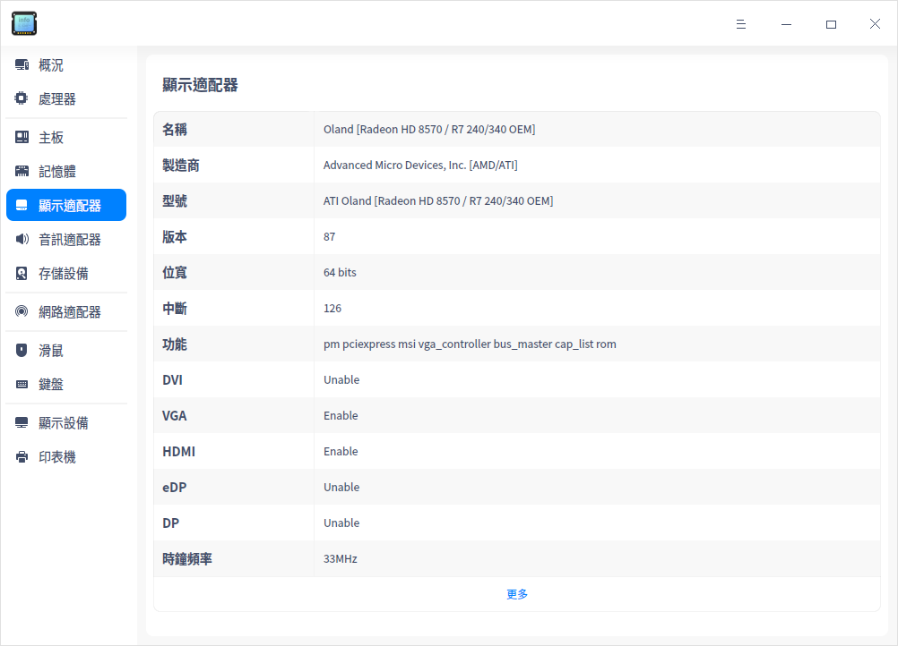
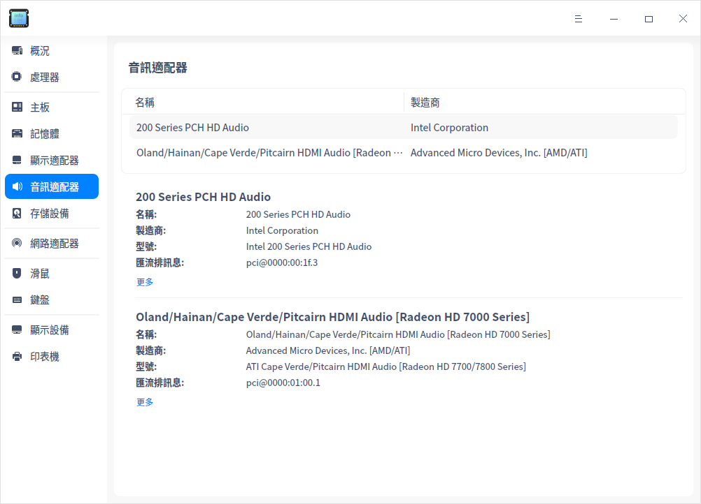
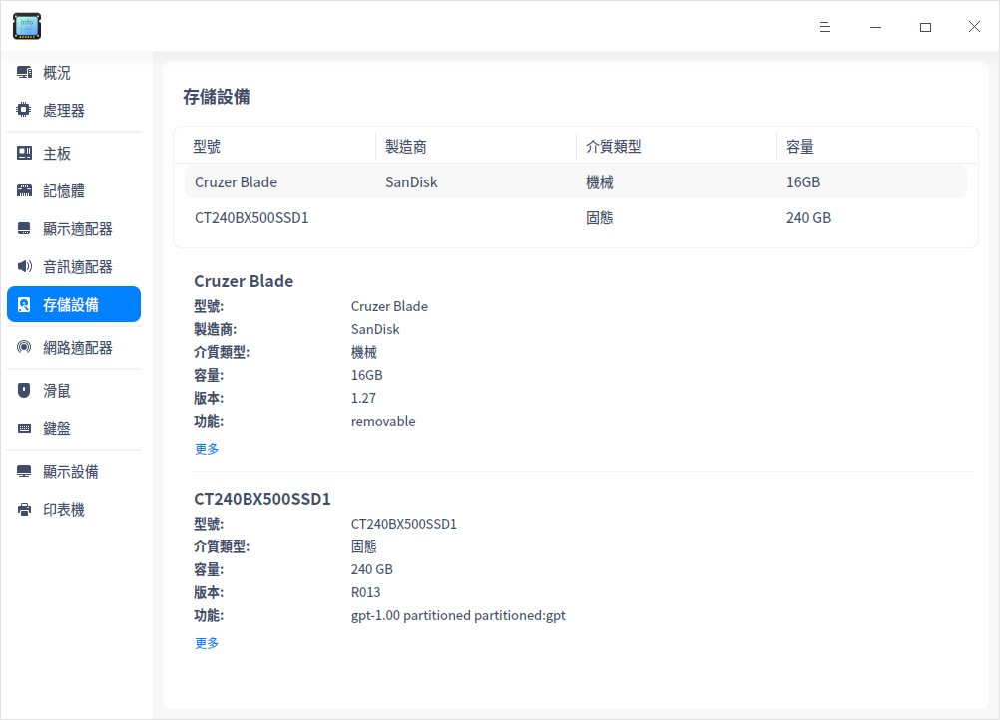
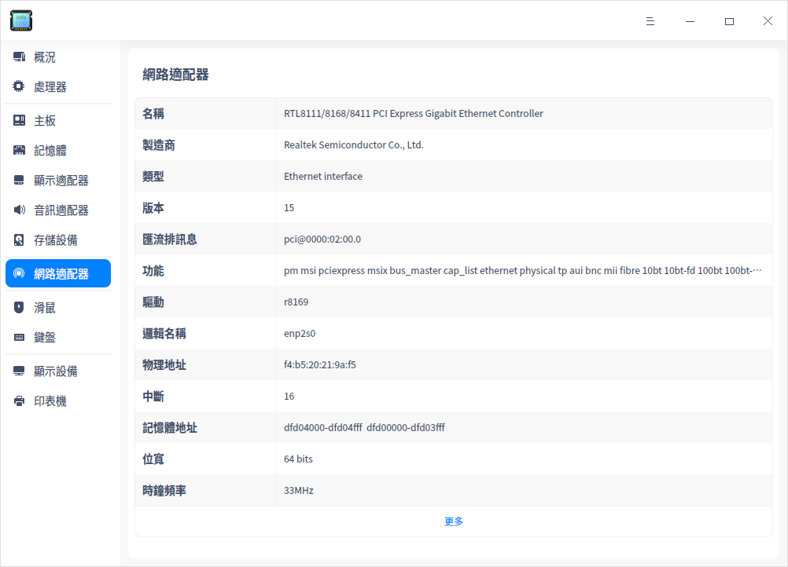
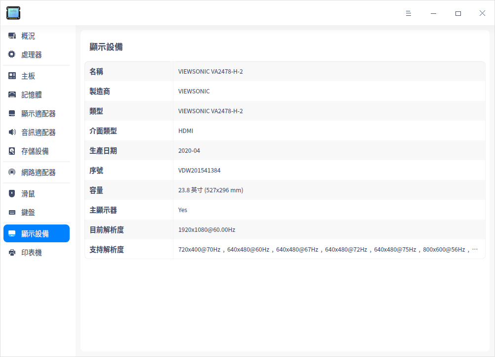
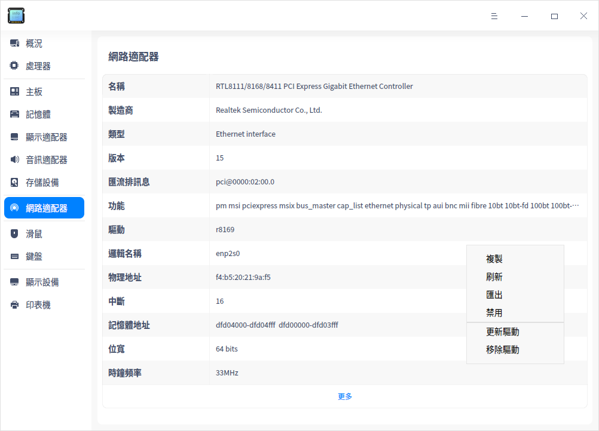

# 設備管理器|deepin-devicemanager|

## 概述

設備管理器是查看和管理硬體設備的工具軟體，可針對執行在作業系統的硬體設備，進行參數狀態的查看、資料訊息的匯出等，還可以禁用或啟動部分硬體驅動。

## 使用入門

您可以透過以下方式執行或關閉設備管理器，或者建立捷徑。

### 執行設備管理器

1. 單擊任務欄上的啟動器 ，進入啟動器介面。

2. 上下滾動滑鼠滾輪瀏覽或透過搜尋，找到「設備管理器」按钮 ，單擊開啟。

3. 右鍵單擊 ，您可以：

   - 單擊 **建立桌面捷徑**，在桌面建立捷徑。

   - 單擊 **釘選到Dock**，將應用程式固定到Dock。

   - 單擊 **開機啟動**，將應用程式添加到開機啟動項，在電腦開機時自動執行該應用程式。

### 關閉設備管理器

- 在設備管理器介面，單擊 ，關閉設備管理器。
- 右鍵單擊任務欄上的  圖示，選擇 **全部關閉** 來關閉設備管理器。
- 在設備管理器介面單擊 ，選擇 **離開** 來關閉設備管理器。

## 裝置訊息

設備管理器展示的訊息與電腦硬體相關，如果您的電腦接入滑鼠、鍵盤等裝置，則會顯示對應的裝置訊息。如果檢測到多個同類型裝置，則以列表形式顯示裝置訊息。以下內容僅作參考，請以實際情況為準。

### 概況

1. 在設備管理器介面，單擊 **概況。**
2. 查看作業系統核心訊息及各硬體裝置列表。

### 處理器

1. 在設備管理器介面，單擊 **處理器**。
2. 介面顯示處理器列表，以及所有處理器的詳細訊息如名稱、製造商、架構及型號等訊息。

### 主板

1. 在設備管理器介面，單擊 **主板**。
2. 介面顯示製造商、晶片組、SMBIOS版本等訊息。

### 記憶體

1. 在設備管理器介面，單擊 **記憶體**。
2. 介面顯示記憶體列表，以及所有記憶體的詳細訊息，如名稱、製造商、容量、類型及頻率等訊息。

### 顯示適配器

1. 在設備管理器介面，單擊 **顯示適配器**。
2. 介面顯示設備的名稱、型號、製造商等訊息。

### 音訊適配器

1. 在設備管理器介面，單擊 **音訊適配器**。
2. 介面顯示音訊適配器列表，以及所有音訊適配器的詳細訊息如名稱、製造商、型號等訊息。

### 存儲設備

1. 在設備管理器介面，單擊 **存儲設備**。
2. 介面顯示存儲設備列表，以及所有存儲設備的詳細訊息如型號、介質類型、容量等訊息。

### 網路適配器

1. 在設備管理器介面，單擊 **網路適配器**。
2. 介面顯示設備的名稱、製造商、類型等訊息。

### 鍵盤

1. 在設備管理器介面，單擊 **鍵盤**。
2. 介面顯示鍵盤的名稱、製造商、型號等訊息。

### 顯示設備

1. 在設備管理器介面，單擊 **顯示設備**。
2. 介面顯示設備的名稱、製造商、類型、介面類型等訊息。

## 操作介紹

在裝置詳細訊息區域，單擊右鍵，可以進行相關操作。

### 複製

複製目前頁面的所有訊息。對於可選中的訊息，也可以局部複製。

### 重新整理

將重新載入作業系統目前所有裝置的訊息，快捷鍵為 **F5**。

### 匯出

將裝置訊息匯出到指定的資料夾，支援匯出 txt/docx/xls/html 格式。

### 禁用/啟用

部分硬體驅動支援禁用和啟用功能，硬體驅動預設是啟用狀態，根據右鍵選單選項判斷是否支援禁用功能。

### 更新驅動

部分硬體支援更新/移除驅動功能，可以根據右鍵選單選項進行判斷。目前僅支援本機驅動文件的安裝更新。

1. 在右鍵選單中選擇 **更新驅動**，彈出視窗。

2. 選擇驅動所在的資料夾，單擊 **下一步** 按鈕。預設勾選「包括子資料夾」，表示檢測資料夾以及子資料夾中包含的驅動文件。

   

3. 系統會檢測該檔案位置包含的所有可安裝的deb和ko格式驅動文件，選擇對應的驅動文件後，單擊 **更新** 按鈕。

   

4. 彈出認證視窗，輸入系統登入密碼完成認證後進行更新。

5. 如果更新失敗了，系統自動將該裝置的驅動回滾至之前的驅動版本，不影響使用。建議根據系統提示尋找失敗原因，重新更新。

### 移除驅動

對於不想使用的裝置，可以移除驅動。

1. 在右鍵選單中選擇 **移除驅動**，二次確認後，單擊 **移除** 按鈕。

   - 移除成功：裝置狀態變為不可用。

   - 移除失敗：原驅動正常使用，建議根據系統提示尋找失敗原因，重新移除。

2. 如果想重新使用該裝置，在裝置詳細訊息頁面單擊右鍵，並選擇 **更新驅動** 安裝驅動。

## 主選單

在主選單中，您可以切換視窗主題，查看說明手冊等操作。

### 主題

視窗主題包含亮色主題、暗色主題和系統主題。

1. 在設備管理器介面，單擊 。
2. 單擊 **主題**，選擇一個主題顏色。

### 說明

查看幫助手冊，透過幫助進一步讓您了解和使用設備管理器。

1. 在設備管理器介面，單擊 。
2. 單擊 **說明**，查看關於設備管理器的說明手冊。

### 關於

1. 在設備管理器介面，單擊 。
2. 單擊 **關於**，查看關於設備管理器的版本和介紹。

### 離開

1. 在設備管理器介面，單擊 。
2. 單擊 **離開**。