# 設備管理器|deepin-devicemanager|

## 概述

設備管理器是查看和管理硬體設備的工具軟體，可針對執行在作業系統的硬體設備，進行參數狀態的查看、資料訊息的匯出等，還可以禁用或啟動部分硬體驅動。

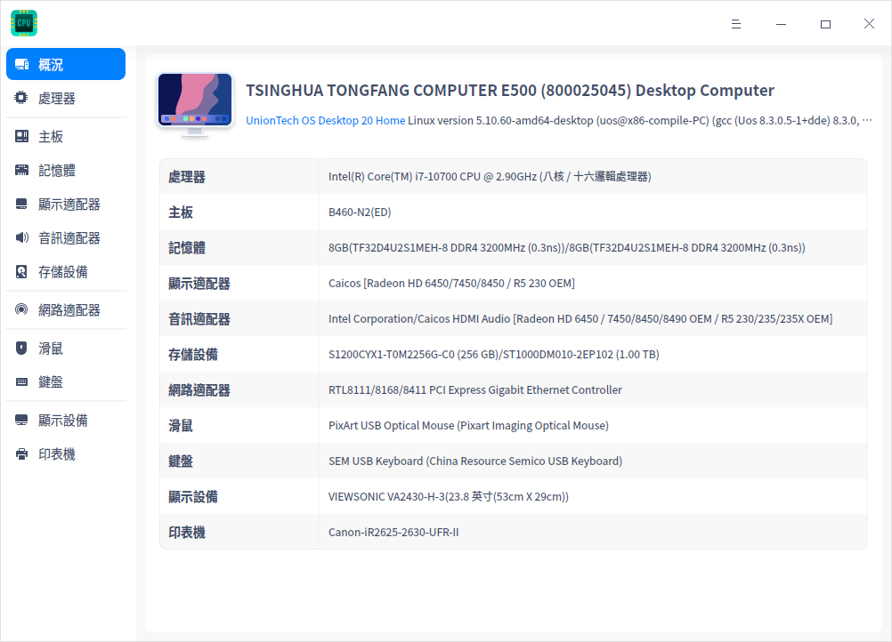

## 使用入門

您可以透過以下方式執行或關閉設備管理器，或者建立捷徑。

### 執行設備管理器

1. 單擊任務欄上的啟動器 ，進入啟動器介面。

2. 上下滾動滑鼠滾輪瀏覽或透過搜尋，找到「設備管理器」按钮 ，單擊開啟。

3. 右鍵單擊 ，您可以：

   - 單擊 **建立桌面捷徑**，在桌面建立捷徑。

   - 單擊 **釘選到Dock**，將應用程式固定到Dock。

   - 單擊 **開機啟動**，將應用程式添加到開機啟動項，在電腦開機時自動執行該應用程式。

### 關閉設備管理器

- 在設備管理器介面，單擊 ，關閉設備管理器。
- 右鍵單擊任務欄上的  圖示，選擇 **全部關閉** 來關閉設備管理器。
- 在設備管理器介面單擊 ，選擇 **離開** 來關閉設備管理器。

## 操作介紹

以下介紹的硬體設備信息僅供參考，如果您的電腦上沒有插入鼠標、鍵盤等設備，設備管理器中則不會顯示對應的硬體信息。

### 概況

1. 在設備管理器介面，單擊 **概況。**
2. 介面顯示 **處理器** 、**主板**、**記憶體** 等硬體列表，以及對應的概要訊息。

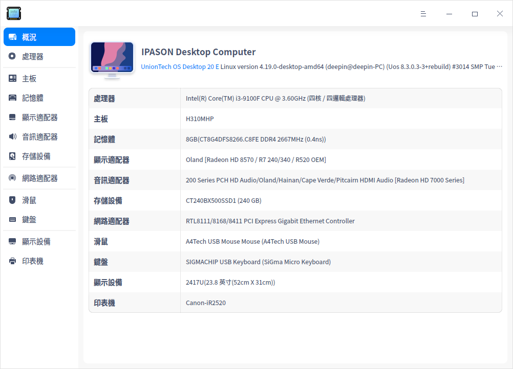

### 處理器

1. 在設備管理器介面，單擊 **處理器**。
2. 介面顯示處理器列表，以及所有處理器的詳細訊息如名稱、製造商、架構及型號等訊息。

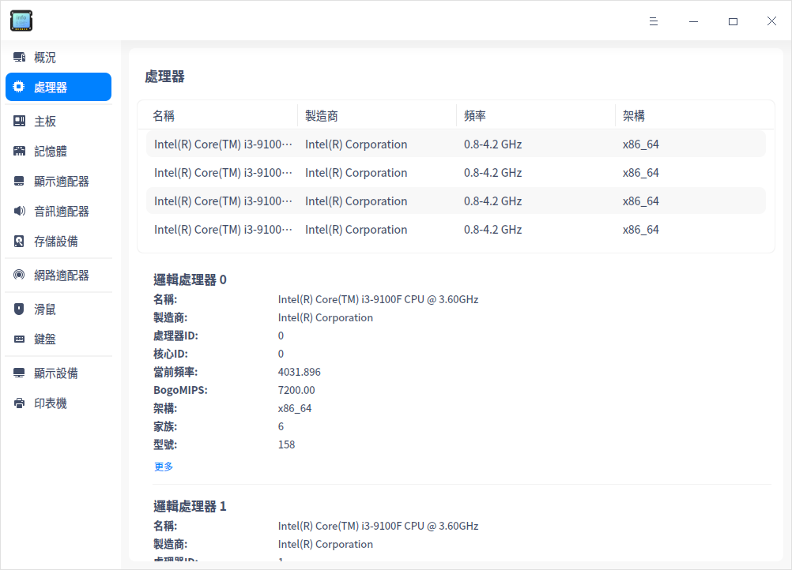

### 主板

1. 在設備管理器介面，單擊 **主板**。
2. 介面顯示製造商、晶片組、SMBIOS版本等訊息。

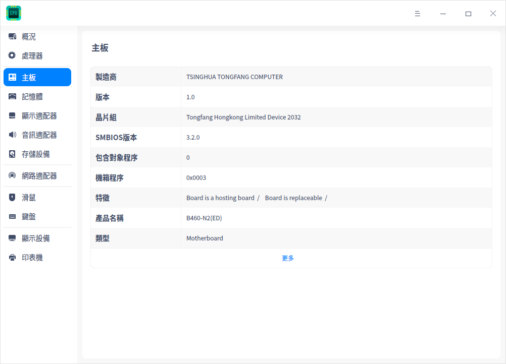

### 記憶體

1. 在設備管理器介面，單擊 **記憶體**。
2. 介面顯示記憶體列表，以及所有記憶體的詳細訊息，如名稱、製造商、容量、類型及頻率等訊息。

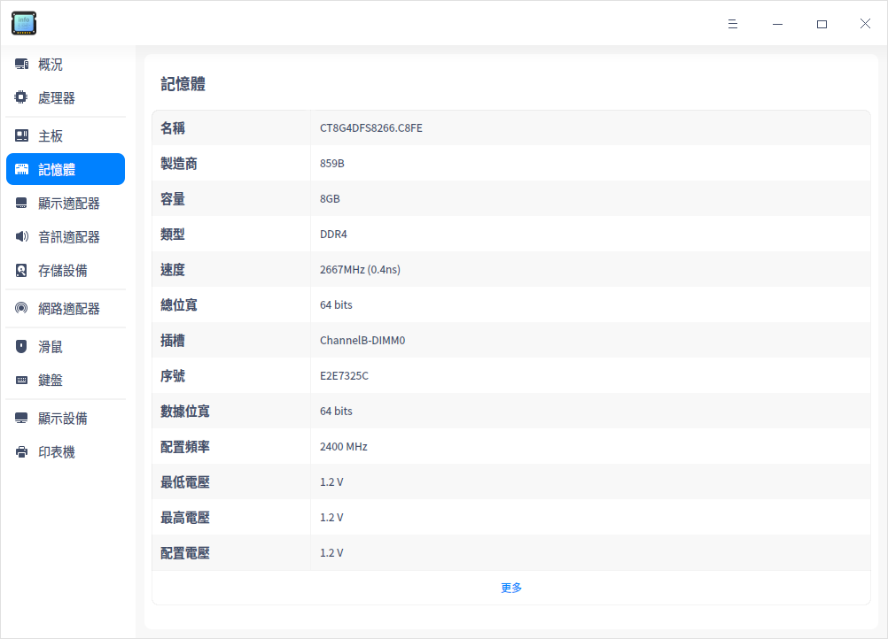

### 顯示適配器

1. 在設備管理器介面，單擊 **顯示適配器**。
2. 介面顯示設備的名稱、型號、製造商等訊息。

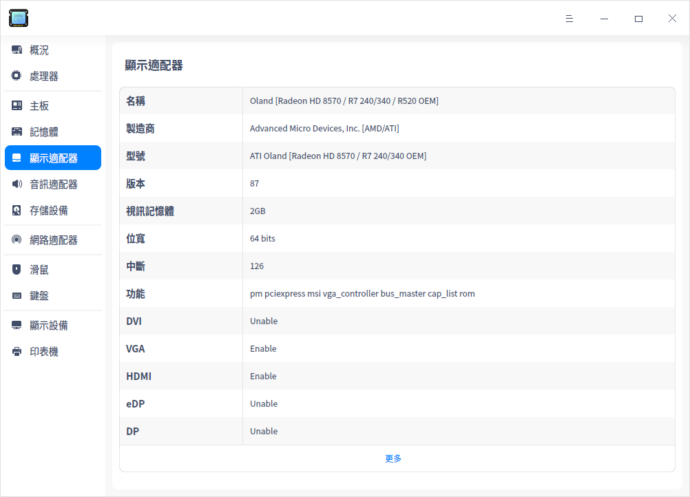

### 音訊適配器

1. 在設備管理器介面，單擊 **音訊適配器**。
2. 介面顯示音訊適配器列表，以及所有音訊適配器的詳細訊息如名稱、製造商、型號等訊息。

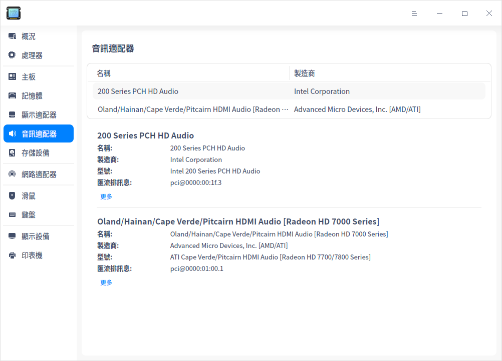

### 存儲設備

1. 在設備管理器介面，單擊 **存儲設備**。
2. 介面顯示存儲設備列表，以及所有存儲設備的詳細訊息如型號、介質類型、容量等訊息。

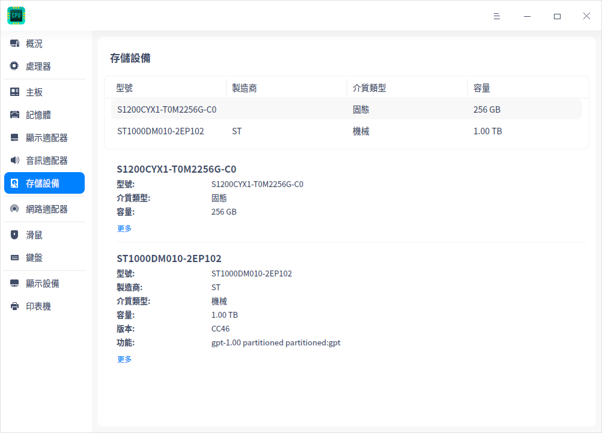

### 網路適配器

1. 在設備管理器介面，單擊 **網路適配器**。
2. 介面顯示設備的名稱、製造商、類型等訊息。

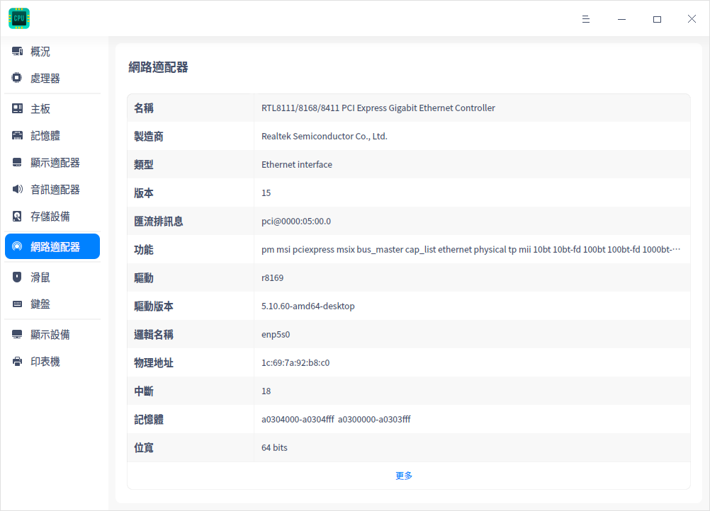

### 滑鼠

1. 在設備管理器介面，單擊 **滑鼠**。
2. 介面顯示滑鼠的名稱、製造商、型號等訊息。

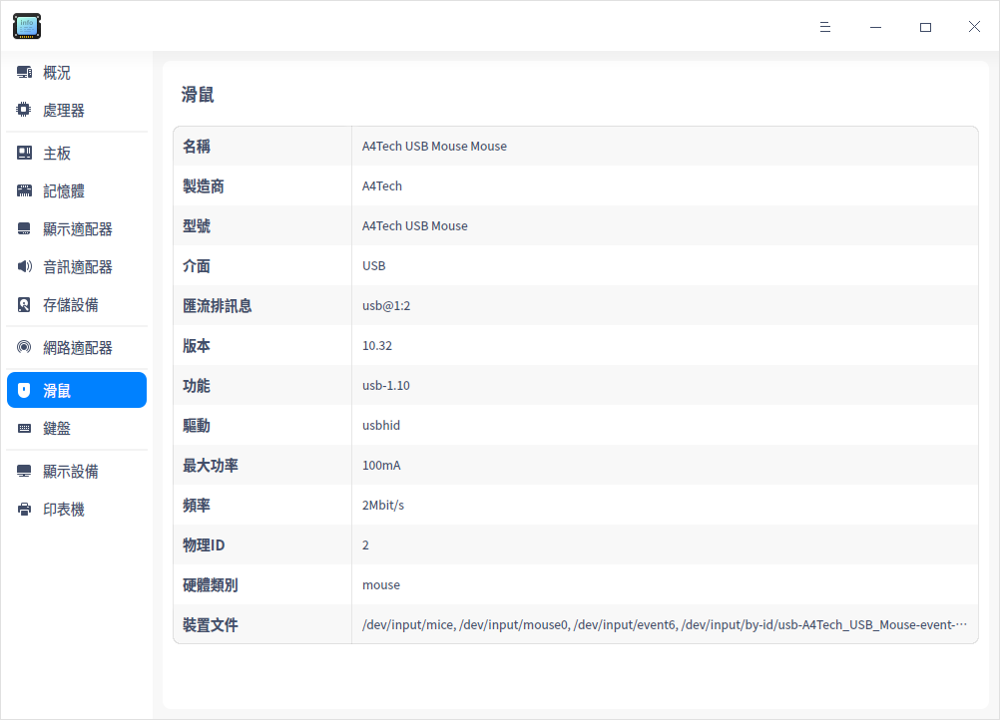

### 鍵盤

1. 在設備管理器介面，單擊 **鍵盤**。
2. 介面顯示鍵盤的名稱、製造商、型號等訊息。

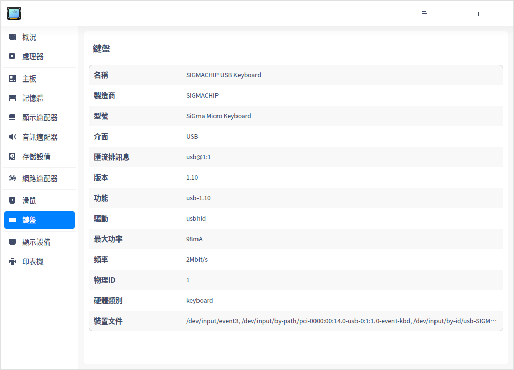

### 顯示設備

1. 在設備管理器介面，單擊 **顯示設備**。
2. 介面顯示設備的名稱、製造商、類型、介面類型等訊息。

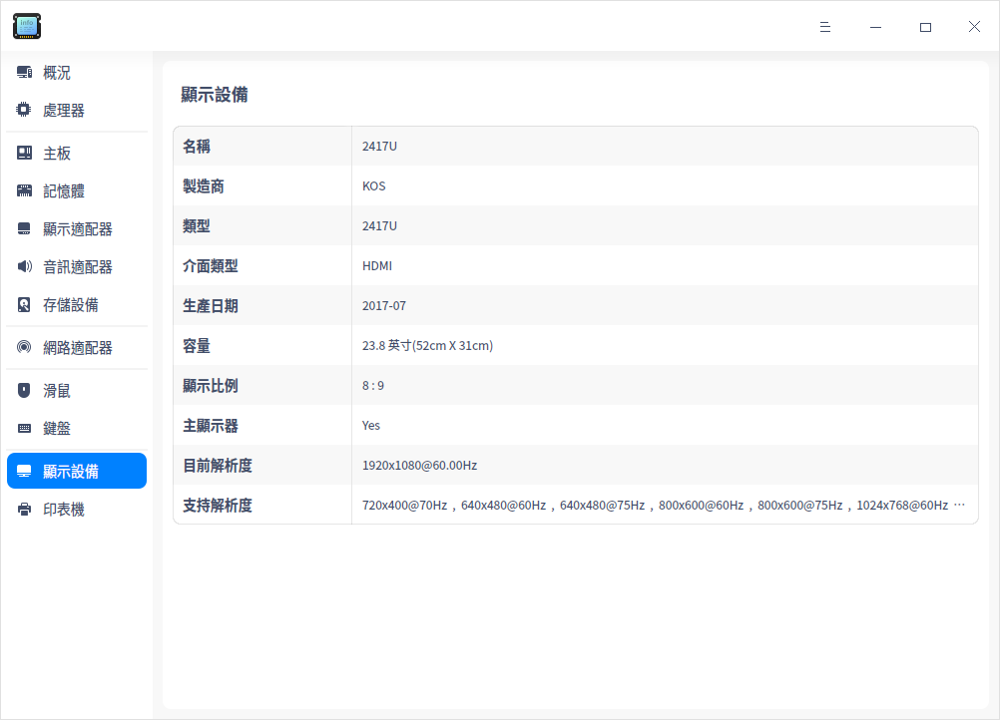

### 印表機

1. 在設備管理器介面，單擊 **印表機**。
2. 介面顯示連接的印表機列表，以及所有印表機的詳細訊息如名稱、型號、製造商等訊息。

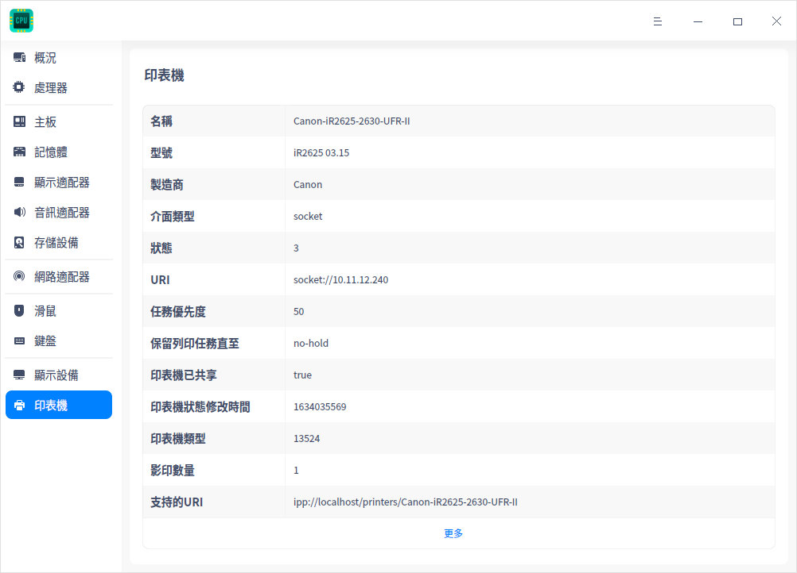

### 右鍵選單

  - **複製**：右鍵單擊 **複製**，可複製游標選中的內容。
  - **禁用/啟用**：可禁用或啟用部分硬體驅動，可根據右鍵選單選項判斷硬體設備是否支持禁用功能。
  - **刷新**：右鍵單擊 **刷新**，將重新載入作業系統目前所有設備的訊息，快捷鍵為 **F5**。
  - **導出**：右鍵單擊 **導出**，彈出文件儲存介面。選擇所需儲存的路徑，確認儲存的檔案名稱及格式（txt/docx/xls/html）後，單擊 **儲存** 則完成所有設備訊息匯出。

## 主選單

在主選單中，您可以切換視窗主題，查看說明手冊等操作。

### 主題

視窗主題包含亮色主題、暗色主題和系統主題。

1. 在設備管理器介面，單擊 。
2. 單擊 **主題**，選擇一個主題顏色。

### 說明

查看幫助手冊，透過幫助進一步讓您了解和使用設備管理器。

1. 在設備管理器介面，單擊 。
2. 單擊 **說明**，查看關於設備管理器的說明手冊。

### 關於

1. 在設備管理器介面，單擊 。
2. 單擊 **關於**，查看關於設備管理器的版本和介紹。

### 離開

1. 在設備管理器介面，單擊 。
2. 單擊 **離開**。