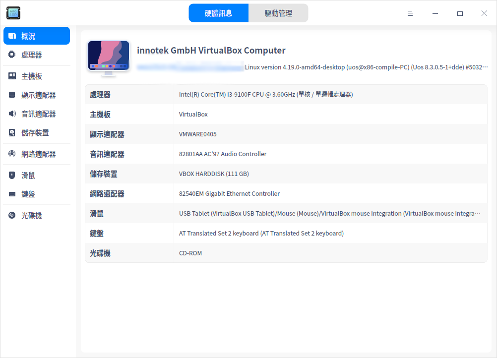

# 裝置管理員|deepin-devicemanager|

## 概述

裝置管理員是檢視和管理硬體裝置的工具，可以檢視運作在作業系統的硬體裝置資訊，並進行驅動管理。

## 使用入門

您可以透過以下方式執行或關閉裝置管理員，或者建立捷徑。

### 執行裝置管理員

1. 按一下工作列上的啟動器圖示 ，進入啟動器介面。
2. 滾動滑鼠或搜尋，找到裝置管理員圖示 ，並按一下執行。
3. 右鍵按一下 ，您可以：
   - 按一下 **傳送到桌面**，在桌面建立捷徑。
   - 按一下 **釘選到工作列**，將應用程式固定到工作列。
   - 按一下 **開機自動啟動**，將應用程式加入到開機啟動項，在電腦開機時自動執行該應用程式。

### 關閉裝置管理員

- 在裝置管理員介面，按一下 ，退出裝置管理員。
- 右鍵按一下工作列上的 ，選擇 **全部關閉** 來退出裝置管理員。
- 在裝置管理員介面按一下 ，選擇 **結束** 來退出裝置管理員。

## 硬體資訊
裝置管理員展示的裝置資訊與電腦硬體相關，如果您的電腦接入滑鼠、鍵盤等裝置，則會顯示對應的裝置資訊。如果偵測到多個同類型裝置，則以清單形式顯示裝置資訊。

### 裝置資訊

在裝置管理員介面，按一下 **硬體資訊**，檢視運作在作業系統上的硬體詳細資訊。

下表主要介紹常見的硬體資訊，僅供參考，請以實際情況為準。

<table class="block1">
    <caption></caption>
    <tbody>
        <tr>
            <td width="150px"><b>硬體名稱</b></td>
            <td><b>硬體資訊</b></td>
        </tr>
        <tr>
            <td>概況</td>
            <td>展示作業系統核心資訊及各硬體裝置清單。</td>
        </tr>
        <tr>
            <td>處理器</td>
            <td>展示處理器的名稱、製造商、處理器及架構等資訊。</td>
        </tr>
        <tr>
            <td>主機板</td>
            <td>展示主機板的製造商、版本、晶片組、SMBIOS版本等資訊。</td>
        </tr>
         <tr>
            <td>記憶體</td>
            <td>展示記憶體的名稱、製造商、大小、類型及速度等資訊。</td>
      </tr>
      <tr>
            <td>顯示配接器</td>
            <td>展示顯示配接器的名稱、製造商、型號等資訊。</td>
        </tr>
       <tr>
            <td>音訊配接器</td>
            <td>展示音訊配接器的名稱、製造商及型號等資訊。</td>
        </tr>
         <tr>
            <td>儲存裝置</td>
            <td>展示儲存裝置的型號、製造商、媒體類型等資訊。</td>
        </tr>
        <tr>
            <td>網路配接器</td>
            <td>展示網路配接器的名稱、製造商、類型及驅動等資訊。</td>
        </tr>
         <tr>
            <td>滑鼠</td>
            <td>展示滑鼠的名稱、製造商、型號及介面等資訊。</td>
        </tr>
          <tr>
            <td>鍵盤</td>
            <td>展示鍵盤的名稱、型號、製造商、介面等資訊。</td>
        </tr>
        <tr>
            <td>顯示裝置</td>
            <td>展示顯示裝置的名稱、製造商、類型、介面類型等資訊。</td>
        </tr>
   </tbody>
   </table>

### 右鍵選單

在裝置詳細資訊區域，按一下右鍵，可以進行相關操作。

#### 複製

複製當前頁面的所有資訊。對於可選中的資訊，也可以局部複製。

#### 重新整理

將重新載入作業系統當前所有裝置的資訊，快速鍵為 **F5**。

#### 導出

將裝置資訊導出到指定的資料夾，支援導出 txt/docx/xls/html 格式。

#### 停用/啟用

部分硬體驅動支援停用和啟用功能，硬體驅動預設是啟用狀態，根據右鍵選單選項判斷是否支援停用功能。

#### 更新驅動

部分硬體支援更新/解除安裝驅動功能，可以根據右鍵選單選項進行判斷。

> 技巧：在驅動管理介面，支援線上更新驅動。

1. 在右鍵選單中選擇 **更新驅動**，彈出視窗。
2. 選擇驅動所在的資料夾，按一下 **下一步** 按鈕。預設勾選「包括子資料夾」，表示偵測資料夾以及子資料夾中包含的驅動檔案。
   
3. 系統會偵測該檔案位置包含的所有可安裝的deb和ko格式驅動檔案，選擇對應的驅動檔案後，按一下 **更新** 按鈕。
   
4. 彈出認證視窗，輸入系統登入密碼完成認證後進行更新。
5. 如果更新失敗了，系統自動將該裝置的驅動回滾至之前的驅動版本，不影響使用。建議根據系統提示查找失敗原因，重新更新。

#### 解除安裝驅動

對於不想使用的裝置，可以解除安裝驅動。

1. 在右鍵選單中選擇 **解除安裝驅動**，二次確認後，按一下 **解除安裝** 按鈕。
   - 解除安裝成功：裝置狀態變為不可用。
   - 解除安裝失敗：原驅動正常使用，建議根據系統提示查找失敗原因，重新解除安裝。
2. 如果想重新使用該裝置，在裝置詳細資訊頁面按一下右鍵，並選擇 **更新驅動** 安裝驅動。

#### 喚醒電腦

當電腦待機時，支援透過滑鼠、鍵盤和網路卡喚醒電腦，點亮螢幕。如果裝置停用，則無法使用該功能。

**透過滑鼠和鍵盤喚醒電腦**

1. 在硬體資訊介面，按一下 **滑鼠** 或 **鍵盤**，顯示裝置詳細資訊。
2. 在詳細資訊區域按一下右鍵，可以勾選或去勾選 **允許喚醒電腦**。
   - 允許喚醒電腦：電腦處於待機狀態時，左擊/右擊/按一下滑鼠中鍵或敲擊該鍵盤任意鍵，可將電腦喚醒，點亮螢幕。
   - 不允許喚醒電腦：電腦處於待機狀態時，左擊/右擊/按一下滑鼠中鍵或敲擊鍵盤，電腦無回應。

**透過網路卡喚醒電腦**

1. 在硬體資訊介面，按一下 **網路配接器**，顯示裝置詳細資訊。
2. 在詳細資訊區域按一下右鍵，可以勾選或去勾選 **允許喚醒電腦**。
   - 允許喚醒電腦：本機處於待機狀態時，其他電腦裝置（在同一網段，即可以ping通對方ip）向本機傳送特殊網路封包請求（Wake On LAN 命令），可將本機喚醒，點亮螢幕。
   - 不允許喚醒電腦：電腦處於待機狀態時，其他電腦裝置（在同一網段，即可以ping通對方ip）向本機傳送特殊網路封包請求（Wake On  LAN 命令），本機無回應。

## 驅動管理

驅動管理主要包括驅動更新偵測、驅動清單資訊展示、驅動線上安裝等內容。

### 驅動更新偵測

開啟裝置管理員，按一下 **驅動管理**，系統會自動偵測是否有可更新/安裝的驅動。

>說明：當啟動電腦時，如果偵測到有可更新/安裝的驅動，會彈出提示資訊，按一下 **檢視** 按鈕則可以進入驅動管理介面。

- 無更新：表示沒有可更新/安裝的驅動，展示無需更新驅動的裝置名稱及版本。
- 有更新：表示偵測到可更新/安裝的驅動，可以進行線上安裝。

如果顯示偵測失敗，根據提示資訊修復問題後按一下 **重新偵測** 再次偵測，對於未知的原因則可以按一下 **意見回饋** 按鈕跳轉到「服務與支援」應用的留言諮詢介面，回饋相關問題。

### 驅動線上安裝

1. 在驅動管理介面，可以檢視可更新/安裝的驅動清單，並進行線上安裝。
2. 如果想要批次安裝，則可以勾選對應的驅動，按一下 **一鍵安裝**，將依次進行安裝。
3. 等待安裝結果。
   - 安裝成功：狀態欄變為「安裝成功」，重新啟動電腦後生效。
   - 安裝失敗：狀態欄變為「安裝失敗」，按一下操作欄按鈕再次嘗試安裝。或按一下狀態欄的「安裝失敗」檢視失敗原因，對於未知的原因，則可以按一下 **意見回饋** 按鈕跳轉到「服務與支援」應用的留言諮詢介面，回饋相關問題。
   - 部分安裝成功：對於批次安裝的驅動，可能部分安裝成功，部分安裝失敗，可以在驅動清單中檢視對應驅動的狀態。

## 主選單

在主選單中，可以進行切換視窗主題，檢視說明手冊等操作。

### 主題
視窗主題包含淺色主題、深色主題和系統主題。
1. 在裝置管理員介面，按一下 。
2. 按一下 **主題**，選擇一個主題顏色。

### 說明
1. 在裝置管理員介面，按一下 。
2. 按一下 **說明**，檢視說明手冊，進一步了解和使用裝置管理員。

### 關於
1. 在裝置管理員介面，按一下 。
2. 按一下 **關於**，檢視裝置管理員的版本和介紹。

### 結束
1. 在裝置管理員介面，按一下 。
2. 按一下 **結束**。